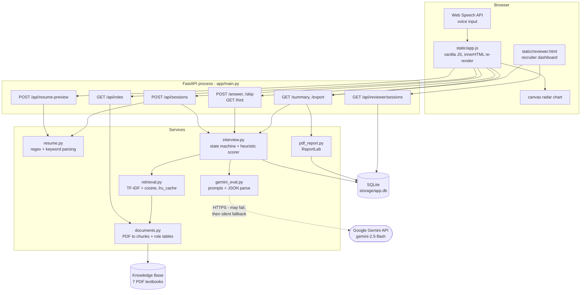

# PROJECT_ANALYSIS.md

> ## ⚠️ Superseded in part — fixes have since been applied
>
> This document is the **pre-fix baseline**. It is preserved deliberately: it records what
> was broken and is the reference the improvements are measured against. Several defects
> described below have since been fixed and re-measured.
>
> **See [`POST_FIX_EVALUATION_REPORT.md`](POST_FIX_EVALUATION_REPORT.md) for the current state.**
>
> | Metric | Before (this document) | After |
> |---|---:|---:|
> | Gemini initialises | No | **Yes** (live call verified) |
> | P(retrieved chunk reaches generator) | 33.3% | **100%** |
> | Causal grounding of questions | 0% | **100%** |
> | Exact duplicate rate (480 questions) | 63.5% | **15.0%** |
> | Same-answer score spread | 15 pts | **0 pts** |
> | Corpus page coverage | 6.2% | **18.6%** |
> | Production top-1 cosine | 0.162 | **0.209** |
> | Known-item Recall@1 (term, same corpus) | 0.973 | 0.973 *(control — unchanged)* |
> | Known-item Recall@1 (term, larger corpus) | — | 0.958 *(a decrease; explained)* |
> | End-to-end regression suite | none existed | **23/23 passing** |


> **Purpose:** A complete, code-verified reference for understanding and explaining this project.
> Every claim below was traced through the actual implementation and, where possible, verified by
> running the server and querying the live API. Statements that are *inferences* about intent are
> explicitly labelled **[Inference]**. Everything else is a **confirmed fact** read from, or executed
> against, the code.
>
> Analysis date: 2026-09-10 · Commit: `616df73 upload` (single-commit repo, branch `main`)

---

## Table of Contents

1. [Project Overview](#1-project-overview)
2. [What Problem It Solves](#2-what-problem-it-solves)
3. [30-Second Explanation](#3-30-second-explanation)
4. [2-Minute Explanation](#4-2-minute-explanation)
5. [Complete Architecture](#5-complete-architecture)
6. [Architecture & Data-Flow Diagrams](#6-architecture--data-flow-diagrams)
7. [Folder Structure](#7-folder-structure)
8. [Important Files](#8-important-files)
9. [Main Workflows](#9-main-workflows)
10. [Frontend](#10-frontend)
11. [Backend](#11-backend)
12. [Database](#12-database)
13. [APIs & Integrations](#13-apis--integrations)
14. [AI / ML](#14-ai--ml)
15. [Authentication & Security](#15-authentication--security)
16. [Deployment](#16-deployment)
17. [Configuration & Environment Variables](#17-configuration--environment-variables)
18. [Error Handling](#18-error-handling)
19. [Performance & Scalability](#19-performance--scalability)
20. [Cost Considerations](#20-cost-considerations)
21. [Known Issues](#21-known-issues)
22. [Important Technical Decisions](#22-important-technical-decisions)
23. [Glossary](#23-glossary)
24. [Likely Interview Questions & Answers](#24-likely-interview-questions--answers)
25. [Things I Absolutely Need To Understand](#25-things-i-absolutely-need-to-understand)

---

## 1. Project Overview

**Name:** PGAGI Candidate Screening (README title: "AI Interview Platform")

An AI-assisted technical interview screening tool. A candidate uploads a resume, picks one of eight
AI/ML/data roles, and is asked **five** questions. Each question is generated from a knowledge base
of ML textbook PDFs retrieved with TF-IDF, then rewritten by Google Gemini. Each answer is scored
0–100 — by Gemini when available, otherwise by a hand-written keyword heuristic. At the end the
candidate sees a summary with a radar chart and can download a PDF report. A separate,
unauthenticated `/reviewer` page lists every session with candidate contact details and scores.

**Scale of the codebase (confirmed):**

| Area | Files | Lines |
|---|---|---|
| Backend (Python) | 10 | ~1,450 |
| Live frontend (`static/`) | 4 | ~1,920 |
| Unused React frontend (`frontend/`) | 4 | ~1,010 |
| Knowledge base | 7 PDFs | ~90 MB (committed to git) |
| Tests | **0** | **0** |

---

## 2. What Problem It Solves

Screening technical candidates at volume is expensive: a human engineer must read a resume, invent
role-appropriate questions, judge the answers, and write a recommendation. This project automates the
first-pass screen:

- **Resume → structured profile** with no manual data entry (name, email, phone, skills, seniority).
- **Role-aware questions** instead of a fixed question bank, so a Data Analyst and an MLOps Engineer
  get different interviews.
- **Consistent numeric scoring** (0–100) plus a written recommendation, so candidates are comparable.
- **A reviewer dashboard and PDF report** so a human can act on the results.

**[Inference]** The app name ("PGAGI Candidate Screening") and the containing folder (`Internship/`)
suggest this was built as an internship or assignment project rather than a production hiring system.
The feature list is broad and demo-oriented, and several advertised features are wired only halfway
(see [Known Issues](#21-known-issues)).

---

## 3. 30-Second Explanation

> It's an AI interview screener. You upload your resume and pick a role like "ML Engineer". The
> backend parses the resume, pulls relevant passages out of a library of machine-learning textbooks
> using TF-IDF search, and asks Gemini to turn those passages into an interview question tailored to
> your background. You type or dictate an answer, Gemini scores it 0–100 with strengths and gaps, and
> the difficulty of the next question adapts to how you're doing. After five questions you get a
> scored summary, a radar chart, and a downloadable PDF report. Recruiters see every candidate on a
> dashboard. It's FastAPI + SQLite + vanilla JavaScript, with a keyword-based scoring fallback for
> when the Gemini API is unavailable.

---

## 4. 2-Minute Explanation

Imagine one Python web server doing five jobs.

**Job 1 — Read the resume.** You upload a PDF (or `.txt`/`.md`). `PyPDF2` extracts the text while
preserving line breaks. Regex rules pull out your **name** (the first line near the top with 2–5
capitalised words and no digits), **email**, and **phone**. Your text is then matched against a
hard-coded list of ~35 skill keywords (`python`, `pytorch`, `rag`…) and ~13 domain keywords
(`classification`, `model evaluation`…). Seniority is guessed from phrases like "4 years" or "intern".
The result is a `ResumeProfile`. **There is no AI in this step** — it is entirely regex and keyword
matching.

**Job 2 — Find relevant reading material.** Nothing happens at startup. On the first request for a
given role, the server opens the PDFs in `Knowledge Base Resources/`, reads the **first 20 pages of
each**, splits them into ~900-character chunks, and builds a **TF-IDF index** with scikit-learn in
memory, cached per role. The eight job roles map to only **three** document collections. A search
query is built by concatenating the role name, your seniority signal, and all your resume keywords;
the top 15 chunks come back and 5 are sampled at random.

**Job 3 — Ask a question.** Those chunk texts, plus your skill list, plus a chosen topic and
difficulty tier, go into a prompt and **Gemini 2.5 Flash** writes one interview question. If Gemini is
unavailable, the code falls back to filling your topic into one of 16 hard-coded sentence templates
(e.g. *"What is {topic} and why does it matter in a {role} context?"*). The topic is chosen at random
from your own resume skills, excluding topics already used in this session.

**Job 4 — Score the answer.** Your answer goes to Gemini with a strict rubric prompt; it returns JSON
with `score`, `level`, `feedback`, `strengths`, `gaps`. If Gemini fails, a heuristic scorer sums five
components — length, topic overlap, overlap with the retrieved textbook chunks ("grounding"),
technical-term count, and whether you cited a number or metric — capped at 100, with anti-gaming
penalties (repeating the question back scores under 8). The running average decides the **next
question's difficulty**: after two answers, an average of 75+ escalates to "advanced".

**Job 5 — Report.** Everything is written to **SQLite**: two tables, `sessions` and `questions`, with
JSON blobs stored in TEXT columns. The summary endpoint averages the scores and emits a recommendation
string. ReportLab renders a PDF. A `/reviewer` page lists every candidate.

The frontend is a **single 1,069-line vanilla JavaScript file** that re-renders the entire page by
assigning to `innerHTML` on every state change — no framework, no build step. There is also an unused
React version in `frontend/` that was superseded and is never served.

---

## 5. Complete Architecture

### 5.1 Runtime shape

A **single Python process**. There is no worker, no queue, no cache server, and no vector database.

```
Browser (static/index.html + app.js, vanilla JS)
   |  fetch() JSON + multipart
   v
Uvicorn --> FastAPI app (app/main.py)      <- ALL routes live in this one file
   |
   +- app/services/resume.py      regex/keyword resume parsing   (no AI)
   +- app/services/documents.py   PDF -> pages -> chunks, role tables
   +- app/services/retrieval.py   TF-IDF index (in-process, lru_cache)
   +- app/services/interview.py   session state machine, scoring orchestration
   +- app/services/gemini_eval.py --- HTTPS ---> Google Gemini API (2.5 Flash)
   +- app/services/pdf_report.py  ReportLab -> PDF bytes
   |
   +--> SQLite  storage/app.db    (WAL mode, one connection per operation)
   +--> Filesystem  "Knowledge Base Resources/*.pdf"  (read-only)
                    storage/_latest_resume.pdf        (write - SHARED path!)
```

### 5.2 What runs locally vs externally

| Component | Where it runs |
|---|---|
| Resume parsing, keyword extraction, seniority | **Local** (regex, PyPDF2) |
| PDF chunking + TF-IDF index + cosine search | **Local** (scikit-learn, in RAM) |
| Question *generation* | **External** — Gemini; local template fallback |
| Answer *evaluation* | **External** — Gemini; local heuristic fallback |
| Skill-gap analysis | **Local** (set logic, `main.py:_build_skill_gap`) |
| Radar chart | **Local** — browser `<canvas>`, `app.js:drawRadarChart` |
| Voice input | **Browser** — Web Speech API (Chrome/Edge only) |
| PDF report | **Local** (ReportLab) |
| Database | **Local file** (SQLite) |

**Only one external service exists: the Google Gemini API.** There is no vector DB, no embedding
model, no auth provider, no object storage, and no analytics.

### 5.3 How the system starts

1. `uvicorn app.main:app` imports `app/main.py`.
2. Importing `app.config` evaluates the `Settings` dataclass **immediately** — the `os.getenv` calls
   are dataclass field defaults, evaluated at class-definition time. ⚠️ `load_dotenv()` has **not run
   yet** (see [Issue #2](#21-known-issues)).
3. `app = FastAPI(...)`; permissive CORS middleware is added.
4. `/assets` is mounted only if `frontend/dist/assets` exists (**it does not** — the React app is never
   built); `/static` is mounted from `static/`.
5. `@app.on_event("startup")` → `init_db()` creates the two tables `IF NOT EXISTS`, sets
   `PRAGMA journal_mode=WAL`, and runs a hand-rolled migration (`_safe_add_columns`) that adds
   `hint_used`, `skipped`, `time_taken_seconds`, `contact_email`, `contact_phone` when missing.
6. **No knowledge base is loaded at startup.** The TF-IDF index is built lazily on the first request
   that needs it and memoised by `@lru_cache(maxsize=8)` on `retrieval.get_index(role)`.
7. `GET /` returns `frontend/dist/index.html` if built, else `static/index.html` → **always
   `static/index.html` in practice.**

---

## 6. Architecture & Data-Flow Diagrams

### 6.1 Component map



### 6.2 One question–answer cycle

```mermaid
sequenceDiagram
    participant U as Candidate
    participant JS as static/app.js
    participant API as main.py
    participant IN as interview.py
    participant RT as retrieval.py
    participant G as Gemini API
    participant DB as SQLite

    U->>JS: types answer, clicks Submit
    JS->>JS: doSubmit() - rejects under 10 chars
    JS->>API: POST /api/sessions/{id}/answer
    API->>IN: answer_current_question()
    IN->>DB: SELECT session, SELECT current question
    IN->>IN: analyze_answer()
    IN->>G: evaluate_with_gemini() - strict rubric prompt
    alt Gemini responds
        G-->>IN: {score, level, feedback, strengths, gaps}
        IN->>IN: cap at 60 if hint used; synthesise 5 radar components from the one score
    else Gemini unavailable or bad JSON
        G--xIN: exception -> returns None (printed to stdout only)
        IN->>IN: heuristic scorer (length + relevance + grounding + technical + specificity)
    end
    IN->>DB: UPDATE questions SET answer_text, analysis, answered_at, time_taken_seconds
    IN->>DB: SELECT COUNT(*) WHERE answered_at IS NOT NULL
    alt count >= 5
        IN->>DB: UPDATE sessions SET status='complete', current_question_id=NULL
        IN-->>API: (analysis, None, complete=True)
        JS->>API: GET /api/sessions/{id}/summary
    else more questions remain
        IN->>RT: build_query(role, profile, previous_answer) then search top 15
        RT-->>IN: 15 SourceChunks -> random.sample picks 5
        IN->>IN: _topic() unused topic; _difficulty() from running score
        IN->>G: generate_question(chunks, topic, difficulty, background)
        G-->>IN: question text, or None -> hard-coded template
        IN->>DB: INSERT question; UPDATE sessions.current_question_id
        IN-->>API: (analysis, next_question, complete=False)
    end
    API-->>JS: AnswerResult JSON
    JS->>JS: setState() -> full innerHTML re-render
    Note over JS: latestAnalysis is set to null -<br/>the score is deliberately hidden until the summary
```

---

## 7. Folder Structure

```
nirogyan__/
├── .env                      GEMINI_API_KEY only (gitignored)   see Issue #2
├── .env.example              8 documented vars - 7 are silently ignored
├── .gitignore                ignores .venv, storage/*.db, check_db.py, test_key.py
├── Procfile                  web: uvicorn app.main:app --host 0.0.0.0 --port $PORT
├── requirements.txt          11 deps - one names the WRONG package (Issue #1)
├── README.md                 333 lines; several claims contradicted by the code
├── check_db.py               throwaway DB inspector (untracked)
├── test_key.py               throwaway DB inspector - NOT a test despite the name (untracked)
│
├── app/                      <- THE BACKEND
│   ├── config.py             frozen dataclass Settings, evaluated at import
│   ├── database.py           sqlite3 helpers, schema DDL, ad-hoc migrations
│   ├── models.py             10 Pydantic models (the API contract)
│   ├── main.py               FastAPI app + ALL 11 routes
│   └── services/
│       ├── documents.py      role tables, PDF -> page -> chunk pipeline
│       ├── retrieval.py      KnowledgeIndex (TF-IDF), build_query
│       ├── resume.py         validation, name/email/phone, keyword profile
│       ├── interview.py      * session state machine + heuristic scorer (568 ln)
│       ├── gemini_eval.py    * both Gemini prompts + fallback plumbing
│       └── pdf_report.py     ReportLab A4 report
│
├── static/                   <- THE LIVE FRONTEND (this is what users get)
│   ├── index.html            14-line shell that loads app.js
│   ├── app.js                * the entire SPA in one file (1,069 ln)
│   ├── styles.css            685 ln
│   └── reviewer.html         self-contained recruiter dashboard (152 ln)
│
├── frontend/                 <- DEAD CODE: React/Vite app, never built, never served
│   ├── package.json          React 19 + Vite 7 - no vite.config.js, no node_modules, no dist
│   └── src/main.jsx          an earlier, simpler version of the same UI
│
├── Knowledge Base Resources/ <- 7 ML textbook PDFs, ~90 MB, committed to git
│   ├── AI or  Machine Learning Role/             (3 files; 1 skipped, it is >25 MB)
│   ├── Data Science or Applied ML Role/          (2 files)
│   └── Advanced or  Theoretical ML (Optional…)/  (2 files)
│
└── storage/
    ├── app.db                SQLite (gitignored)
    └── _latest_resume.pdf    SHARED temp path for every upload - see Issue #5
```

---

## 8. Important Files

Format: `file → purpose → why it matters → what it interacts with`

| File | Purpose | Why it matters | Interacts with |
|---|---|---|---|
| **`app/services/interview.py`** | The session state machine: create question, score answer, advance, summarise. Holds `MAX_QUESTIONS = 5`, the 3-tier difficulty rule, the topic picker, the 16 fallback question templates, and the entire heuristic scorer. | **The single most important file.** Understand this and you understand the product; all business logic lives here. | `retrieval`, `gemini_eval`, `database`, `models`, `documents` |
| **`app/services/gemini_eval.py`** | Both LLM prompts (evaluation + question generation), the client singleton, JSON extraction, and the silent-failure contract (`return None`). | Defines the entire AI behaviour and — critically — how the system degrades when the AI is unavailable. | `google.genai` SDK, `interview.py` |
| **`app/main.py`** | Every HTTP route (11), CORS, static mounts, startup hook, skill-gap computation. | The API surface and the entry point; the only file mapping URLs to logic. | all services, `models`, `database` |
| **`static/app.js`** | The whole candidate SPA: state object, `render()` via `innerHTML`, all fetch calls, canvas radar chart, voice input. | This is what users actually see. Also where ~6 advertised features sit as dead code. | all `/api/*` endpoints |
| **`app/services/retrieval.py`** | `KnowledgeIndex` — TF-IDF fit + cosine search; `get_index` memoised per role; `build_query`. | The "R" in RAG. A small file, but it decides what every question is grounded in. | `documents.py`, scikit-learn |
| **`app/services/documents.py`** | Role → name / summary / knowledge-base / required-skills tables; PDF page extraction; chunking. | Holds the four role lookup dicts that drive the entire role system, plus the page and size caps that quietly shrink the corpus. | `PyPDF2`, `config`, `retrieval`, `main` |
| **`app/services/resume.py`** | File validation, PDF → text, name/email/phone regex, keyword taxonomy, seniority heuristic. | Everything downstream (topic choice, difficulty, skill gap, retrieval query) depends on the profile it produces. | `documents.extract_pdf_text_raw`, `models` |
| **`app/database.py`** | Schema DDL, `db()` context manager, JSON encode/decode, `_safe_add_columns` migration. | Defines persistence and the "JSON in a TEXT column" pattern used throughout. | `sqlite3`, `config` |
| **`app/models.py`** | Pydantic request/response models. | The formal API contract. `AnswerResult.analysis` is an untyped `dict[str, Any]`, which is why the analysis shape differs between the two evaluators. | FastAPI, all services |
| **`app/config.py`** | `Settings` frozen dataclass built from env vars. | Small, but the source of the silent `.env` bug (Issue #2) and of the two corpus-limiting caps. | every module |
| **`static/reviewer.html`** | Self-contained recruiter dashboard (HTML + CSS + JS in one file). | The only multi-candidate view; also the site of the stored-XSS sink and the `'complete'` vs `'completed'` bug. | `/api/reviewer/sessions`, `/api/sessions/{id}/export` |
| **`app/services/pdf_report.py`** | ReportLab A4 report builder. | The candidate-facing deliverable; contains the `float(None)` crash (Issue #4). | `main.py`, `reportlab` |
| **`frontend/src/main.jsx`** | **Superseded React version.** No contact fields, no skip/hint/voice/timer/radar/PDF. | Matters only so you don't mistake it for the live UI when explaining the project. | nothing — never served |

---

## 9. Main Workflows

### Workflow A — Upload resume and auto-fill contact details

```
User picks a file in the "Resume" input
    ↓
static/app.js  →  change listener (bindEvents, line ~1004)
                  sets state.resume = file, calls autoFillFromResume(file)
    ↓
POST /api/resume-preview          multipart, field name "resume"
    ↓
app/main.py:resume_preview()
    ├─ resume.validate_resume_file(filename, content_type, content)
    │     · extension must be .pdf / .txt / .md
    │     · a .pdf must start with the b"%PDF" magic bytes
    ├─ resume.parse_resume_upload()
    │     · writes bytes to storage/_latest_resume.pdf   <-- SHARED PATH (Issue #5)
    │     · documents.extract_pdf_text_raw() keeps newlines so name detection works
    ├─ resume.quick_validate_resume_text()   lenient: 15..4000 words, and must have
    │     contact info OR a standalone section header OR a known tech keyword
    └─ infer_candidate_name / extract_email / extract_phone   (pure regex)
    ↓
Response: {"name": ..., "email": ..., "phone": ...}   or   {"error": "..."}
    ↓
app.js fills #contact-name / #contact-email / #contact-phone, shows a "Detected"
badge; on error it clears the file input and renders a red banner
```

**Verified live:** a plain-text resume returned
`{'name': 'Jane Doe', 'email': 'jane.doe@example.com', 'phone': '+91 98765 43210'}`.
A 2-word file, a `.pdf` with wrong magic bytes, and an `.exe` were each rejected with distinct
messages.

Note the error contract here is unusual: **validation failures return HTTP 200 with an `error` key**,
not a 4xx status.

### Workflow B — Start the interview (the most important path)

```
User submits #start-form
    ↓
app.js:startInterview()  - client-side guards: resume present, no prior resume
                           error, name/email/phone non-empty (shake animation on fail)
    ↓
POST /api/sessions   multipart: role, resume, candidate_name, contact_email, contact_phone
    ↓
main.py:create_session()
    ├─ role must be a key of ROLE_DESCRIPTIONS else 400 "Unknown role"
    ├─ validate_resume_file() + parse_resume_upload()
    ├─ validate_resume_text()  strict: 40..3000 words
    ├─ build_resume_profile(text)
    │     · find_keywords vs SKILL_KEYWORDS (35 terms) -> technologies[:14]
    │     · find_keywords vs DOMAIN_KEYWORDS (13 terms) -> domains[:10]
    │     · seniority_signal(): "N years" >= 3 -> experienced;
    │       intern/fresher/student/trainee -> early-career;
    │       >700 words -> project-heavy; else entry-level
    │     · form candidate_name overrides the auto-detected one
    ├─ interview.start_session()
    │     ├─ INSERT INTO sessions (uuid4, status='active', resume_text, profile JSON, contacts)
    │     └─ create_question(session_id, role, profile)          <-- see Workflow C
    └─ _build_skill_gap(role, profile)
          compares ROLE_REQUIRED_SKILLS[role] against the candidate keyword set:
          exact -> "match", substring either way -> "partial", else "gap"
    ↓
SessionCreated {session_id, candidate_name, role, profile, question, skill_gap}
    ↓
app.js: state.session/question set, questionIndex = 1, renders the interview screen
```

### Workflow C — Generate one question (`interview.create_question`)

```
create_question(session_id, role, profile, previous_answer)
    ↓
1. SELECT COUNT(*) FROM questions WHERE session_id = ?      -> answered_count
   SELECT topic  FROM questions WHERE session_id = ?        -> used_topics
   (note: answered_count actually counts questions CREATED, not answered)
    ↓
2. _get_running_score(session_id)
   mean of analysis.score over answered, non-skipped questions
    ↓
3. retrieval.build_query(role, profile, previous_answer)
   -> "ai-engineer interview experienced python pytorch rag ... <previous answer text>"
    ↓
4. get_index(role)                          @lru_cache(maxsize=8)
   ROLE_KNOWLEDGE_BASE maps 8 roles -> 3 collections (ai-ml / data-science / advanced-ml)
   First call for a role: load PDFs -> first 20 pages each -> ~900-char chunks
                          -> TfidfVectorizer(stop_words="english", max_features=18000,
                                             ngram_range=(1,2)).fit_transform
   Measured: ai-ml 100 chunks / 2.2 s, data-science 113 / 0.9 s, advanced-ml 87 / 1.3 s
    ↓
5. .search(query, fetch_k = max(top_k*3, 12) = 15)   cosine similarity, drop score <= 0
   then random.sample(all_sources, 5)      <-- randomised for variety
    ↓
6. _topic(profile, sources, used_topics)
   prefers an unused keyword from the candidate's own domains+technologies+skills;
   if exhausted, falls back to the most common 5+ letter word in the retrieved text
    ↓
7. _difficulty(profile, answered_count, running_score)
   running_score >= 75 AND answered_count >= 2   -> "advanced"
   seniority in {experienced, project-heavy} OR answered_count >= 2 -> "intermediate"
   otherwise                                     -> "foundational"
    ↓
8. _question_text(...) -> gemini_eval.generate_question(role, topic, difficulty,
                                                        background, chunk_texts)
   · top 3 chunks joined, truncated to 1200 chars
   · temperature 0.7, max_output_tokens 256, thinking_budget 0
   · rejected if the reply is < 30 chars or contains a blank line -> None
   · on None: random.choice over 5 foundational / 6 intermediate / 5 advanced templates,
     with a specificity suffix appended for intermediate and advanced
    ↓
9. INSERT INTO questions (id, session_id, question_text, topic, difficulty,
                          source_chunks JSON, created_at)
   UPDATE sessions SET current_question_id = ?
```

### Workflow D — Submit an answer

```
User clicks "Submit Answer"
    ↓
app.js:doSubmit()  - client guard: trimmed length >= 10
    ↓
POST /api/sessions/{id}/answer   {"answer": ..., "time_taken_seconds": ...}
    ↓
main.py:submit_answer()  - server guard: len(answer.strip()) >= 10 else 400
    ↓
interview.answer_current_question()
    ├─ SELECT session; SELECT question WHERE id = session.current_question_id
    │     (missing session or question -> ValueError -> HTTP 404)
    ├─ analyze_answer(answer, question_text, topic, sources, hint_used, role, difficulty)
    │   ├─ TRY gemini_eval.evaluate_with_gemini()
    │   │     temperature 0.1, max_output_tokens 512,
    │   │     response_mime_type="application/json", thinking_budget 0
    │   │     regex-extract the first {...} block, json.loads, clamp score to 0..100
    │   │     hint_used -> score = min(score, 60)
    │   │     component_scores are SYNTHESISED from the single score
    │   │       (x1.00 length, x1.10 relevance, x0.95 grounding,
    │   │        x1.05 technical, x0.90 specificity, each capped at 100)
    │   └─ ELSE heuristic scorer:
    │         copy-paste guard: overlap with question words >= 0.55, or fewer than 10
    │           original words -> immediate "off-topic", score <= 8
    │         length 0-15 + relevance 0-30 + grounding 0-25 + technical 0-15
    │           + specificity 0 or 15   = 0..100
    │         caps: generic phrase -> 20; <20 original words -> 25; <35 -> 40;
    │               no topic overlap and no grounding -> 22;
    │               no grounding and <80 words -> 45; hint used -> 60
    │         level: >=78 strong, >=60 adequate, >=35 developing,
    │                <20 words thin, else off-topic
    ├─ UPDATE questions SET answer_text, analysis JSON, answered_at, time_taken_seconds
    ├─ SELECT COUNT(*) WHERE answered_at IS NOT NULL     (skips count toward this)
    └─ if count >= MAX_QUESTIONS (5):
           UPDATE sessions SET status='complete', current_question_id=NULL
           return (analysis, None, True)
       else:
           create_question(..., previous_answer=answer)   -> Workflow C
    ↓
AnswerResult {analysis, next_question, complete}
    ↓
app.js: if complete -> GET /summary and render the summary screen
        else -> render the next question; latestAnalysis is set to null on purpose,
                so the per-answer score is hidden until the end; a 2-second
                "Answer recorded" toast is shown instead
```

**Verified live** (5-question session, Gemini unavailable so heuristic used): scores 60, 69, 64, 64,
69 → average 65.2 → `"Promising — consider a focused follow-up on weaker topics."` Difficulty stayed
`intermediate` throughout because the running score never reached 75.

### Workflow E — Skip / Hint

```
SKIP:  app.js confirm() dialog -> POST /skip
       -> writes answer_text="", skipped=1, a fixed analysis with score 0,
          level "skipped", all component_scores 0
       -> counts toward the 5-question limit (answered_at is set)

HINT:  GET /hint  (backend fully implemented and working)
       -> takes the first sentence longer than 40 chars from the top retrieved chunk
       -> sets hint_used = 1, which caps that answer at 60
       -> WARNING: no UI button calls this. fetchHint() and hintPanelTemplate()
          are defined in app.js but never invoked, so candidates cannot reach it.
```

### Workflow F — Summary and PDF export

```
GET /api/sessions/{id}/summary
    ↓
interview.session_summary()
    - loads every question ordered by created_at
    - averages scores over non-skipped questions, rounded to 1 decimal
    - Counter over grounding_terms -> insights.strong_terms (top 8)
    - recommendation(): >=75 "Strong candidate", >=60 "Promising", else "Needs more evidence"
    ↓
app.js:summaryTemplate() renders: score ring, verdict pill, stat boxes,
recommendation box, canvas radar, per-question cards
drawRadarChart() averages component_scores across non-skipped questions

GET /api/sessions/{id}/export
    ↓
main.py:export_pdf() -> session_summary() -> extra SELECT for contact info
    -> pdf_report.generate_pdf_report() -> StreamingResponse(application/pdf)
    -> filename: interview_report_{candidate_name with _ and lowercase}.pdf
```

### Workflow G — Reviewer dashboard

```
GET /reviewer  ->  FileResponse("static/reviewer.html")     <- no auth
    ↓
GET /api/reviewer/sessions                                  <- no auth
    ↓
One GROUP BY query joining sessions and questions:
  COUNT(q.id) total_q, SUM(answer_text IS NOT NULL AND skipped=0) answered,
  SUM(skipped=1) skipped, AVG(json_extract(q.analysis,'$.score')) avg_score
    ↓
reviewer.html renders name, email, phone, role, score pill, progress, date, PDF link
```

---

## 10. Frontend

### 10.1 Which frontend is live

**`static/` is the live frontend.** `main.py:index()` serves `frontend/dist/index.html` only when it
exists; `frontend/dist` does not exist, there is no `node_modules`, and there is no `vite.config.js`.
`frontend/src/main.jsx` is an **earlier React version** lacking contact fields, skip, hint, voice,
timer, radar, and PDF export. Treat it as dead code.

### 10.2 Architecture of `static/app.js`

- **State:** one module-level `const state = {...}` object.
- **Rendering:** `setState(patch)` does `Object.assign(state, patch)` then `render()`, and `render()`
  assigns a fully rebuilt HTML string to `document.getElementById("root").innerHTML`, then re-runs
  `bindEvents()` and `postRenderAnimations()`. Every listener is re-attached on every render.
- **Escaping:** a helper `esc()` HTML-escapes all interpolated values. This is applied consistently in
  `app.js` — but **not** in `reviewer.html` (see Issue #7).
- **Stage machine:** `stage()` derives the screen from state — `summary` → Summary, `session` →
  Interview, otherwise Candidate Entry.
- **Targeted DOM patching:** typing does *not* trigger a full re-render. The `input` listener updates
  `state.answer` and calls `liveUpdateQuality()`, which patches only the word-count/quality bar. This
  is what stops the textarea from losing focus on every keystroke.
- **Canvas radar:** `drawRadarChart()` hand-draws 5 grid rings, 5 axes, the data polygon, dots, and
  labels with the Canvas 2D API. No chart library.
- **Voice:** `toggleVoice()` uses `webkitSpeechRecognition` with `continuous`/`interimResults`, and
  auto-restarts in `onend` because the Web Speech API stops after each pause. Chrome/Edge only.
- **Theme:** `data-theme` attribute on `<html>`, toggled in the sidebar. Not persisted across reloads.

### 10.3 Features defined but never wired (confirmed by grep — each appears exactly once, its own definition)

| Function | Feature | Status |
|---|---|---|
| `landingTemplate()` | Animated hero landing screen with orbs and CTA | Never rendered |
| `startTimer()` / `timerTemplate()` / `updateTimerDOM()` | 120-second per-question countdown ring | Never started; `app.js` even comments *"Timer removed — kept in state but not started"* |
| `fetchHint()` / `hintPanelTemplate()` | Hint UI | Never called (backend works) |
| `scoreRevealTemplate()` | Per-answer animated score reveal | Never rendered — `latestAnalysis` is always set to `null` |

Consequence: `time_taken_seconds` is always `0` (the frontend sends `state.timeTaken`, which never
increments). Confirmed in the database: values are only `0` or `NULL`. The summary's `⏱ Ns` badge
therefore never appears, because `0` is falsy.

---

## 11. Backend

### 11.1 Route table (all in `app/main.py`)

| Method | Path | Handler | Notes |
|---|---|---|---|
| GET | `/` | `index` | Serves the SPA shell |
| GET | `/api/health` | `health` | `{"status": "ok"}` |
| GET | `/api/roles` | `roles` | 8 roles + description + `document_count` + required skills |
| POST | `/api/resume-preview` | `resume_preview` | **Returns 200 with `{"error": ...}` on failure** |
| POST | `/api/sessions` | `create_session` | Multipart; creates session + first question |
| POST | `/api/sessions/{id}/answer` | `submit_answer` | 400 if under 10 chars; 404 if session/question missing |
| POST | `/api/sessions/{id}/skip` | `skip_question` | Score 0, counts toward the 5 |
| GET | `/api/sessions/{id}/hint` | `get_hint` | Works; no UI reaches it |
| GET | `/api/sessions/{id}/summary` | `get_summary` | Full session summary + insights |
| GET | `/api/sessions/{id}/export` | `export_pdf` | Streams PDF; 500 on any internal error |
| GET | `/api/reviewer/sessions` | `reviewer_sessions` | **All candidate PII, unauthenticated** |
| GET | `/reviewer` | `reviewer_page` | Dashboard HTML, unauthenticated |

`/api/sessions/{id}/export` and `/api/reviewer/sessions` import `app.database.db` **inside the
function body** rather than at module top — a small inconsistency, presumably added late.
**[Inference]**

### 11.2 Service responsibilities

- **`resume.py`** — pure functions, no DB, no network. Validation is layered: `validate_resume_file`
  (extension/MIME/magic bytes) → `quick_validate_resume_text` (lenient, upload time) →
  `validate_resume_text` (strict, 40–3000 words, session creation). `find_keywords` uses a
  `(?<![a-z0-9])keyword(?![a-z0-9])` boundary so `"api"` doesn't match inside `"rapid"`.
- **`documents.py`** — four lookup dicts (`ROLE_DESCRIPTIONS`, `ROLE_SUMMARIES`,
  `ROLE_KNOWLEDGE_BASE`, `ROLE_REQUIRED_SKILLS`) plus `ROLE_DIR_HINTS`, which maps a collection id to
  a **substring of the directory name** (note the deliberate double spaces, e.g.
  `"AI or  Machine Learning Role"`). `chunk_text` splits on sentence boundaries when one falls past
  55% of the window, otherwise hard-cuts, and overlaps by `CHUNK_OVERLAP`.
- **`retrieval.py`** — 53 lines. `KnowledgeIndex` fits TF-IDF over the chunk texts; `search` returns
  `SourceChunk`s with the text truncated to 900 chars. `get_index` is `lru_cache`d per role.
- **`interview.py`** — orchestration plus the heuristic scorer. Note that DB access uses several
  short-lived `with db()` blocks rather than one transaction per request.
- **`gemini_eval.py`** — module-level `_client` and `_available` singletons. `_init()` is memoised via
  `_available is not None`, so **a failure at startup is permanent for the process lifetime** — the
  key is never retried.
- **`pdf_report.py`** — imports ReportLab lazily inside the function so the app still boots without
  it; raises `RuntimeError` if absent.

---

## 12. Database

**Technology:** SQLite via the stdlib `sqlite3` module. No ORM. WAL journal mode. A new connection is
opened and closed per operation by the `db()` context manager, which commits on clean exit.

### `sessions`

| Column | Type | Notes |
|---|---|---|
| `id` | TEXT PK | `uuid.uuid4()` string |
| `candidate_name` | TEXT | Form value if provided, else the regex-inferred name |
| `role` | TEXT NOT NULL | One of the 8 role ids |
| `resume_text` | TEXT NOT NULL | **Full raw resume text stored verbatim** |
| `resume_profile` | TEXT NOT NULL | JSON-encoded `ResumeProfile` |
| `status` | TEXT NOT NULL | **`'active'` or `'complete'`** — *not* `'completed'` |
| `current_question_id` | TEXT | Set to NULL when the session completes |
| `created_at` / `updated_at` | TEXT | ISO-8601 UTC strings |
| `contact_email` / `contact_phone` | TEXT | Added by `_safe_add_columns` migration |

### `questions`

| Column | Type | Notes |
|---|---|---|
| `id` | TEXT PK | uuid4 |
| `session_id` | TEXT NOT NULL | FK to `sessions(id)` — **declared but not enforced**, since `PRAGMA foreign_keys` is never turned on |
| `question_text`, `topic`, `difficulty` | TEXT NOT NULL | |
| `source_chunks` | TEXT NOT NULL | JSON array of the 5 retrieved chunks, each up to 900 chars → **~4.5 KB of duplicated textbook text per question row** |
| `answer_text` | TEXT | `""` for a skipped question |
| `analysis` | TEXT | JSON; **shape differs between the Gemini and heuristic evaluators** |
| `hint_used`, `skipped` | INTEGER | 0/1 flags |
| `time_taken_seconds` | INTEGER | Always 0 or NULL in practice |
| `created_at`, `answered_at` | TEXT | `answered_at IS NOT NULL` is the "this question is done" signal |

**Indexes:** only the two implicit primary-key indexes. There is **no index on
`questions.session_id`**, despite it being the filter column on nearly every query.

**Migrations:** `_safe_add_columns` reads `PRAGMA table_info` and issues `ALTER TABLE ... ADD COLUMN`
for anything missing. It only ever adds columns — it cannot rename, drop, or backfill.

**Reads/writes by flow:** `start_session` → 1 INSERT; `create_question` → 2 SELECT + 1 INSERT +
1 UPDATE; `answer_current_question` → 2 SELECT + 1 UPDATE + 1 COUNT (+1 UPDATE on completion);
`session_summary` → 2 SELECT; reviewer → 1 aggregate query.

**Current contents (verified):** 2 original sessions, 10 questions; all `status='complete'`; all
`analysis.evaluator` = NULL, i.e. **every stored evaluation used the heuristic fallback, never
Gemini**.

---

## 13. APIs & Integrations

### External service #1 (and only): Google Gemini API

| Aspect | Detail |
|---|---|
| **Why** | To generate questions grounded in retrieved text, and to grade free-text answers — neither is feasible with keyword rules alone. |
| **Where called** | `gemini_eval.evaluate_with_gemini()` (from `interview.analyze_answer`) and `gemini_eval.generate_question()` (from `interview._question_text`). |
| **SDK** | `from google import genai` → `genai.Client(api_key=...)` → `client.models.generate_content(...)`. This is the **`google-genai`** package. |
| **Model** | `gemini-2.5-flash`, hard-coded as `_MODEL`. |
| **Data sent** | Question generation: role, candidate skill list, topic, difficulty, and up to 1,200 chars of textbook text. Evaluation: role, topic, difficulty, question text, and **the candidate's verbatim answer**. Resume text, name, email, and phone are **never** sent. |
| **Data returned** | Generation: raw question text. Evaluation: JSON with `score`, `level`, `feedback`, `strengths`, `gaps`. |
| **Auth** | `GEMINI_API_KEY` env var, read lazily inside `_init()`. |
| **Failure behaviour** | Any exception → a `print()` to stdout → `return None` → caller silently falls back. **The user and the database are never told the AI was skipped** (except by the absence of an `evaluator` key). |

There are no other network integrations. `reviewer.html` loads Inter from Google Fonts — a static
asset fetch, not an API.

---

## 14. AI / ML

This project has **two distinct "AI" layers**, and conflating them is the most common way to explain
it wrongly.

### Layer 1 — Classical ML: TF-IDF retrieval (always on, local)

- **Library:** scikit-learn `TfidfVectorizer` + `cosine_similarity`.
- **Parameters:** `stop_words="english"`, `max_features=18000`, `ngram_range=(1, 2)`.
- **Corpus:** `Knowledge Base Resources/**/*.pdf`, filtered by `MAX_DOCUMENT_MB=25` and truncated to
  `MAX_PAGES_PER_DOCUMENT=20`, chunked at `CHUNK_SIZE=900` with `CHUNK_OVERLAP=160`.
- **Measured corpus size:** ai-ml 100 chunks, data-science 113, advanced-ml 87.
- **Query:** `f"{role} interview {seniority} {profile_terms} {previous_answer}"`.
- **Retrieval:** top `max(TOP_K*3, 12)` = **15** by cosine, drop scores ≤ 0, then `random.sample` 5.

> **This is not a vector database and there are no embeddings.** It is lexical bag-of-words matching.
> The index is rebuilt from scratch in memory on first use per role and cached with `lru_cache`.

**Critical measured limitation:** with a 20-page cap, the indexed corpus is the **front matter** of
each textbook. Inspecting the chunks shows copyright pages, title pages, and prefaces alongside early
chapter content. Observed cosine scores in real sessions are **0.07–0.09** — very weak matches. The
"RAG grounding" is therefore much thinner than the README implies.

### Layer 2 — Generative AI: Gemini 2.5 Flash (optional, external)

#### 2a. Question generation — `generate_question()`

Prompt (`_QUESTION_PROMPT`) supplies role, candidate background (first 12 skills, comma-joined),
topic, difficulty, and the top 3 chunks joined and truncated to 1,200 chars. It instructs the model to
ground the question in the retrieved content, match the difficulty tier
(foundational → explain + example, intermediate → apply with a constraint or metric, advanced →
defend a design or handle a failure mode), avoid naming PDF filenames, and return only the question.

Parameters: `temperature=0.7`, `max_output_tokens=256`, `thinking_config=ThinkingConfig(thinking_budget=0)`.

Post-processing: strip quotes; reject and fall back if the result is under 30 chars or contains a
blank line.

#### 2b. Answer evaluation — `evaluate_with_gemini()`

Prompt (`_PROMPT`) supplies role, topic, difficulty, question, and answer, and demands a JSON object
with an explicit band rubric (80–100 accurate + metrics + tradeoffs, down to 0–9 off-topic/copy-paste),
plus two hard rules: mirroring the question must score below 8, and a correct one-liner must not
exceed 45.

Parameters: `temperature=0.1`, `max_output_tokens=512`,
`response_mime_type="application/json"`, `thinking_budget=0`.

Post-processing: `re.search(r"\{.*\}", raw, re.DOTALL)` extracts the first JSON block (defensive
against stray text), `json.loads`, clamp score to 0–100, and repair `level` from the score if the
model returns an unrecognised label.

**Note what is *not* sent to the evaluator:** the retrieved source chunks. The evaluation prompt has
no reference material, so Gemini grades from its own knowledge — the README's claim that the
evaluation prompt "includes the source material" is incorrect.

#### 2c. The synthesised radar (important and easy to misstate)

When Gemini is used, the five radar components are **not measured**. They are derived from the single
overall score:

```python
s = score / 100
component_scores = {
    "length":      min(100, round(s * 100)),
    "relevance":   min(100, round(s * 110)),
    "grounding":   min(100, round(s * 95)),
    "technical":   min(100, round(s * 105)),
    "specificity": min(100, round(s * 90)),
}
```

So under Gemini the radar is always the **same pentagon shape**, merely scaled. Only the heuristic
path produces genuinely independent axes. Gemini results also return `grounding_terms: []`, which
makes `insights.strong_terms` empty in the summary.

### Layer 3 — The heuristic fallback scorer (`interview.analyze_answer`)

Runs whenever Gemini returns `None`. Pure Python, deterministic given the same inputs.

| Component | Max | Rule |
|---|---|---|
| Length | 15 | `min(original_word_count / 60, 1) * 15` |
| Relevance | 30 | 10 points per topic word present, capped |
| Grounding | 25 | 5 points per word shared with the retrieved chunks, capped |
| Technical | 15 | 5 points per term from a 26-word `TECHNICAL_TERMS` set, capped |
| Specificity | 15 | 15 if a regex finds a number, `%`, or a word like precision/recall/latency/tradeoff |

Anti-gaming: a copy-paste guard (≥55% question-word overlap, or fewer than 10 original words) returns
"off-topic" with a score ≤ 8 immediately; then caps for generic phrases (20), short answers (25 / 40),
no topic overlap and no grounding (22), no grounding under 80 words (45), and hint used (60).

**Observed weakness:** in a live trace, the *identical* answer submitted five times scored 60, 69, 64,
64, and 69. The variance comes entirely from the randomly sampled source chunks changing the
`grounding_terms` overlap — so the heuristic score partly measures which textbook pages happened to be
drawn, not the answer.

### Fallback / error handling summary

| Failure | Behaviour |
|---|---|
| No `GEMINI_API_KEY` | `_available = False` forever; heuristics only; a `print` to stdout |
| SDK import fails | Same as above (**this is the current state — see Issue #1**) |
| API error / timeout / rate limit | `print` + `return None` → heuristic for that call only |
| Response has no `{...}` | `print` + `return None` |
| Generated question too short or multi-paragraph | Falls back to a hard-coded template |

There is **no retry, no backoff, no circuit breaker, and no user-visible signal.** The `timeout=10.0`
parameter is accepted by both functions and **never used** — no timeout is passed to the SDK.

### Training / inference

**No training, no fine-tuning, no embeddings, no vector store.** Inference is entirely remote
(Gemini). The only "fitting" is `TfidfVectorizer.fit_transform` over the chunks at index build time.

---

## 15. Authentication & Security

**There is no authentication or authorisation anywhere in this project.** No login, no sessions, no
API keys, no roles.

| Concern | Reality |
|---|---|
| Candidate session access | Guarded only by an unguessable `uuid4` session id |
| Reviewer dashboard | `/reviewer` and `/api/reviewer/sessions` are **fully public** |
| PII exposure | That endpoint returns every candidate's name, email, phone, score, and **session id** — and the session id grants access to `/summary` and the PDF report |
| CORS | `allow_origins=["*"]` with `allow_credentials=True` — an invalid combination that browsers reject, and far too permissive regardless |
| XSS | `static/app.js` escapes consistently via `esc()`. **`static/reviewer.html` does not** — `candidate_name`, `contact_email`, and `contact_phone` are interpolated straight into `innerHTML`, and `candidate_name` comes from a user-controlled form field. Stored XSS against the recruiter. |
| SQL injection | Not present in user-facing paths — all values are parameterised. `_safe_add_columns` interpolates table/column names into DDL, but only from hard-coded literals. |
| File upload | Reasonably defended: extension allowlist, MIME allowlist, `%PDF` magic-byte check, NUL-byte check for text, word-count bounds. No explicit byte-size limit on the upload itself. |
| Secrets | `.env` is gitignored; only `GEMINI_API_KEY` is stored there. |
| Data retention | Full resume text is stored indefinitely in SQLite with no deletion path — a GDPR/DPDP concern for real candidate data. |
| Error leakage | `export_pdf` returns the raw exception string in the HTTP 500 detail. |

---

## 16. Deployment

- **`Procfile`:** `web: uvicorn app.main:app --host 0.0.0.0 --port $PORT` — targets Render/Railway/Heroku-style platforms.
- **Build:** `pip install -r requirements.txt`. No Dockerfile, no CI, no GitHub Actions, no lockfile
  (every dependency is unpinned).
- **Frontend build:** none required — `static/` is served directly. The React app would need
  `npm install && npm run build`, but has no `vite.config.js`.
- **Single process, single worker.** No `--workers` flag anywhere.

**Deployment risks specific to this repo:**

1. **The Gemini SDK will not install.** `requirements.txt` lists `google-generativeai`, but the code
   imports `from google import genai` (the `google-genai` package). A clean deploy therefore runs
   heuristics-only, silently. See Issue #1.
2. **Ephemeral filesystem.** SQLite lives at `storage/app.db`; on Render/Railway free tiers this is
   wiped on every restart or deploy. The README acknowledges this.
3. **~90 MB of PDFs are committed to git**, so every clone and deploy pays that cost. Distributing
   copyrighted textbooks in a repo is also a licensing concern.
4. **Cold start cost.** The first request per role pays 1–2 s of PDF parsing plus TF-IDF fitting, and
   free tiers spin down often, so this recurs.
5. **`storage/_latest_resume.pdf`** requires a writable working directory.

---

## 17. Configuration & Environment Variables

| Variable | Read in | Default | **Does it actually work?** |
|---|---|---|---|
| `GEMINI_API_KEY` | `gemini_eval._init()` | — | ✅ Yes — read lazily, after `load_dotenv()` |
| `APP_NAME` | `config.Settings` | `PGAGI Candidate Screening` | ❌ Ignored from `.env` |
| `DATABASE_PATH` | `config.Settings` | `storage/app.db` | ❌ Ignored from `.env` |
| `KNOWLEDGE_BASE_PATH` | `config.Settings` | `Knowledge Base Resources` | ❌ Ignored from `.env` |
| `CHUNK_SIZE` | `config.Settings` | `900` | ❌ Ignored from `.env` |
| `CHUNK_OVERLAP` | `config.Settings` | `160` | ❌ Ignored from `.env` |
| `TOP_K` | `config.Settings` | `5` | ❌ Ignored from `.env` |
| `MAX_DOCUMENT_MB` | `config.Settings` | `25` | ❌ Ignored from `.env` (and undocumented in the README) |
| `MAX_PAGES_PER_DOCUMENT` | `config.Settings` | `20` | ❌ Ignored from `.env` (and undocumented in the README) |

**Why the ❌ rows fail — verified:** `Settings` is a `@dataclass(frozen=True)` whose field defaults call
`os.getenv(...)`. Dataclass field defaults are evaluated **once, when the class body executes** — i.e.
at `import app.config` time. `load_dotenv()` is called at import of `app.services.gemini_eval`, which
happens *later* in the import graph. Proven experimentally:

```
1. after `import app.config`        -> GEMINI_API_KEY in os.environ?  False
2. after `import gemini_eval`       -> GEMINI_API_KEY in os.environ?  True
=> .env is loaded AFTER app.config has already frozen its settings
```

These variables still work if exported as **real process environment variables** (e.g. set in the
Render dashboard) — only `.env` file loading is affected.

---

## 18. Error Handling

**The pattern:** services raise `ValueError` for expected problems; route handlers catch `ValueError`
and translate it into an `HTTPException`.

| Layer | Behaviour |
|---|---|
| Resume validation | `ValueError` with a user-friendly message → 400 on `/api/sessions`, but **200 + `{"error": ...}`** on `/api/resume-preview` |
| Missing session/question | `ValueError("Session not found")` → 404 |
| Short answer | 400 "Answer is too short" (both client and server side) |
| Unknown role | 400 "Unknown role" |
| PDF generation | Catches bare `Exception` → 500 with the **raw exception text** in the detail |
| Gemini failure | Swallowed entirely — `print()` to stdout, then heuristic fallback |
| `resume_preview` | Catches bare `Exception` → generic "Could not read this file" |
| Frontend | Every `fetch` is wrapped in try/catch, setting `state.error`, rendered as a red banner; resume errors get a dedicated inline banner |

**Weaknesses:**

- **No logging framework.** Every diagnostic is a bare `print()` — no levels, no timestamps, no
  structured fields, nothing routable to a log aggregator.
- **Silent AI degradation.** The most consequential failure in the system produces no user-visible
  signal, no metric, and no database marker other than a missing `evaluator` key.
- Two bare `except Exception` blocks mask genuine bugs (e.g. the `float(None)` crash surfaces only as
  a generic "PDF generation failed").
- No `PRAGMA foreign_keys=ON`, so orphaned question rows are possible.

---

## 19. Performance & Scalability

**Measured:** health and roles respond instantly. Index build costs 0.9–2.2 s per role on first use,
then it is cached for the process lifetime.

| Bottleneck | Detail | Impact |
|---|---|---|
| Gemini latency on the critical path | Up to **two blocking calls per submission** (evaluate + generate next question), on sync `def` handlers | Each submission runs in a threadpool worker for potentially several seconds |
| Sync handlers | `submit_answer`, `skip_question`, `get_hint`, `get_summary` are `def`, not `async def` | FastAPI runs them in a bounded threadpool; heavy Gemini latency will exhaust it under load |
| No index on `questions.session_id` | Every session query is a full scan | Fine at 10 rows, degrades linearly |
| `source_chunks` duplication | ~4.5 KB of textbook text copied into every question row | Database grows ~22 KB per session for data already on disk |
| `resume_text` stored in full | Whole resume in the `sessions` row | Row bloat + a privacy liability |
| SQLite single-writer | WAL helps readers, but writes serialise | Concurrent interviews will contend |
| In-process TF-IDF index | Up to 8 indices in RAM per process | Cannot be shared across workers; each worker rebuilds its own |
| Connection per operation | `create_question` alone opens 2 separate connections | Extra syscalls per request |
| Full `innerHTML` re-render | Entire DOM rebuilt on every state change | Fine at this size; would not scale to a larger UI |

**Concurrency hazards:** `parse_resume_upload` writes every PDF to the **same** path
(`storage/_latest_resume.pdf`) and immediately reads it back. Two simultaneous uploads can interleave,
so one candidate can be profiled from another candidate's resume. Separately, two concurrent answer
submissions on the same session could both read the same `current_question_id` and each create a next
question.

---

## 20. Cost Considerations

**Gemini 2.5 Flash is the only variable cost.** Per completed 5-question interview:

- ~5 question-generation calls: prompt ≈ 1,200 chars of chunks + instructions (roughly 500–700 tokens
  in), ≤ 256 tokens out.
- ~5 evaluation calls: prompt ≈ question + answer + rubric (roughly 400–800 tokens in), ≤ 512 out.
- **Total ≈ 10 calls, very roughly 8–12 K input and up to 4 K output tokens per interview.**

Flash is among the cheapest Gemini tiers, so per-interview cost is fractions of a cent.
`thinking_budget=0` is set on both calls, which **disables Gemini's thinking tokens** — a deliberate
latency and cost optimisation. **[Inference]**

**Cost-relevant design notes:**

- The knowledge base itself costs nothing to run (local TF-IDF), avoiding embedding API charges.
- There is **no caching of Gemini responses** — a re-submitted identical answer is billed again.
- There is **no rate limiting**, so the endpoints are open to cost-amplification abuse by anyone with
  the URL.
- Infrastructure is otherwise essentially free (single small process + a SQLite file).

---

## 21. Known Issues

Severity: 🔴 critical · 🟠 high · 🟡 medium · ⚪ low

### 🔴 1. `requirements.txt` names the wrong Gemini package — the AI silently never runs

- **What:** `requirements.txt` lists `google-generativeai`, which provides `google.generativeai`. The
  code does `from google import genai` and `from google.genai import types`, which come from the
  **`google-genai`** package.
- **Where:** `requirements.txt:7` vs `app/services/gemini_eval.py:33, 101, 212`.
- **Verified:** `_init()` fails with `cannot import name 'genai' from 'google'`; every one of the 10
  stored question rows has `analysis.evaluator = NULL`, i.e. every historical evaluation used the
  heuristic.
- **Why it matters:** The headline feature is dead on a clean install, and the failure is *silent* —
  candidates still get scores, so nobody notices the AI is absent. Fix: `google-genai`.

### 🔴 2. `.env` variables other than `GEMINI_API_KEY` are silently ignored

- **What:** `load_dotenv()` runs at import of `gemini_eval`, long after `app/config.py` has already
  evaluated its dataclass defaults.
- **Where:** `app/config.py:12-20` vs `app/services/gemini_eval.py:13-17`.
- **Verified experimentally** (see [§17](#17-configuration--environment-variables)).
- **Why it matters:** Every documented tuning knob — `TOP_K`, `CHUNK_SIZE`, `DATABASE_PATH`,
  `KNOWLEDGE_BASE_PATH` — appears configurable but is not. Someone tuning retrieval via `.env` would
  see no effect and no error. Fix: call `load_dotenv()` at the top of `app/config.py`.

### 🟠 3. Reviewer dashboard never shows a PDF link — `'complete'` vs `'completed'`

- **What:** The backend writes `status='complete'`; `reviewer.html` tests `r.status==='completed'`.
- **Where:** `interview.py:289, 495` vs `static/reviewer.html:99, 133`.
- **Verified:** all DB rows are `'complete'`; the live reviewer payload returns `"status": "complete"`.
- **Effect:** the "Completed" stat card always reads **0**, and every row shows "In progress" instead
  of a PDF download link — so a recruiter can never download a report from the dashboard.

### 🟠 4. PDF export crashes with HTTP 500 when no question was answered

- **What:** `avg = round(float(insights.get("average_score", 0)))`. The key **exists** with value
  `None`, so `.get`'s default never applies and `float(None)` raises `TypeError`.
- **Where:** `app/services/pdf_report.py:67`; caught by `main.py:215` → 500.
- **Verified:** an all-skipped session returns `"average_score": null`, and `float(None)` raises.
- **Effect:** any candidate who skips all five questions cannot export a report.

### 🟠 5. Shared temp file for resume uploads — cross-candidate data leak

- **What:** Every uploaded PDF is written to the single path `storage/_latest_resume.pdf` and read
  back immediately.
- **Where:** `app/services/resume.py:128-131`.
- **Effect:** two concurrent uploads race; candidate A can be profiled from candidate B's resume.
  Also leaves the most recent candidate's resume on disk indefinitely. Fix: `tempfile` or in-memory
  `io.BytesIO`.

### 🟠 6. Reviewer dashboard and its API are completely unauthenticated

- **What:** `/reviewer` and `/api/reviewer/sessions` have no access control and return every
  candidate's name, email, phone, score, **and session id**.
- **Where:** `app/main.py:220-249`.
- **Effect:** anyone who knows the URL harvests all candidate PII, and the session ids let them fetch
  every summary and PDF report.

### 🟠 7. Stored XSS in the reviewer dashboard

- **What:** `reviewer.html` interpolates `candidate_name`, `contact_email`, and `contact_phone`
  directly into `innerHTML` with no escaping, while `app.js` carefully escapes everywhere via `esc()`.
- **Where:** `static/reviewer.html:123-138`.
- **Effect:** a candidate typing `` into the name field executes script in the
  recruiter's browser. Fix: use `textContent`, or an `esc()` helper as in `app.js`.

### 🟡 8. Six advertised features are dead code in the shipped UI

Verified by grep — each of these appears exactly once in `app.js`, at its own definition:

| Feature | Function | README says |
|---|---|---|
| Landing/hero screen | `landingTemplate()` | (documented in the file header) |
| 120-second timer | `startTimer()`, `timerTemplate()` | "Per-answer timer displayed to candidate" |
| Hint UI | `fetchHint()`, `hintPanelTemplate()` | "Hint system (available once per question)" |
| Per-answer score reveal | `scoreRevealTemplate()` | — |

Consequence: `time_taken_seconds` is always 0 or NULL, so the timing data the schema and PDF report
expect never exists.

### 🟡 9. The Gemini radar chart is synthetic

`component_scores` under Gemini are the single overall score multiplied by five fixed constants
(1.00 / 1.10 / 0.95 / 1.05 / 0.90). The "Performance Radar" therefore shows the same pentagon shape
every time, and communicates no per-dimension information. **Where:** `interview.py:326-333`.

### 🟡 10. The RAG corpus is mostly textbook front matter

`MAX_PAGES_PER_DOCUMENT=20` truncates each book to its first 20 pages. Inspecting the indexed chunks
shows title pages, copyright notices, and prefaces. `MAX_DOCUMENT_MB=25` also **silently skips** the
58 MB *Artificial Intelligence, Machine Learning & Deep Learning.pdf* in the AI/ML folder. Observed
retrieval scores are 0.07–0.09. So "RAG over a curated knowledge base" is technically true but far
weaker than it sounds.

### 🟡 11. Heuristic scores are non-deterministic for the same answer

Because `create_question` does `random.sample(all_sources, 5)`, the grounding-term overlap changes per
question, so an identical answer scored **60, 69, 64, 64, 69** in one traced session. Scoring partly
measures which textbook pages were drawn. **Where:** `interview.py:163`, `interview.py:390`.

### 🟡 12. No timeout is applied to Gemini calls

Both functions accept `timeout: float = 10.0` and **never use it**. The SDK call has no deadline, so a
hung request blocks a threadpool worker indefinitely. **Where:** `gemini_eval.py:84, 187`.

### 🟡 13. Gemini availability is decided once and never retried

`_init()` short-circuits on `_available is not None`, so a transient startup failure (missing key,
network blip) disables the AI for the entire process lifetime. **Where:** `gemini_eval.py:24-41`.

### 🟡 14. README contradicts the code in at least eight places

| README claim | Code reality |
|---|---|
| "Accepts PDF resumes only" | `.pdf`, `.txt`, and `.md` are all accepted (`ALLOWED_RESUME_EXTENSIONS`) |
| Seniority: "fresher / junior / mid-level / senior / lead" | Actual values: `experienced`, `early-career`, `project-heavy`, `entry-level` |
| Level: "poor / adequate / good / excellent" | Actual: `strong`, `adequate`, `developing`, `thin`, `off-topic` |
| "status: `active` or `completed`" | Actual: `active` or `complete` |
| Evaluation prompt "includes ... source material" | The evaluation prompt contains no chunks |
| "Per-answer timer displayed to candidate" | Timer is never started |
| "Hint system" | No UI path reaches the endpoint |
| Reviewer view is "sortable and filterable" | Search-filter only; no sorting |

The env-var table also omits `MAX_DOCUMENT_MB` and `MAX_PAGES_PER_DOCUMENT` — the two settings that
most constrain the knowledge base.

### ⚪ 15. Smaller items

- **Dead React app** (`frontend/`, ~1,010 lines) with no `vite.config.js`, `node_modules`, or `dist`.
- **No tests at all.** `test_key.py` is a DB inspector script, not a test, and is gitignored.
- **No index on `questions.session_id`**; `PRAGMA foreign_keys` never enabled.
- **CORS** `allow_origins=["*"]` with `allow_credentials=True` — an invalid pairing.
- **`@app.on_event("startup")`** is deprecated in modern FastAPI in favour of lifespan handlers.
- **Grammar bug in the fallback templates:** `f"For a {role_label} role…"` yields *"For a AI Engineer
  role"* — visible in stored questions.
- **`answered_count`** in `create_question` actually counts questions *created*, not answered.
- **Unpinned dependencies** — no version constraints and no lockfile.
- **~90 MB of copyrighted textbooks committed to git.**
- **Full resume text retained indefinitely** with no deletion endpoint.
- **`export_pdf` leaks raw exception text** into the HTTP 500 response body.
- **Theme choice is not persisted** across page reloads.

---

## 22. Important Technical Decisions

Format: Decision → Why (labelled where inferred) → Benefit → Tradeoff

| # | Decision | Why | Benefit | Tradeoff |
|---|---|---|---|---|
| 1 | **TF-IDF instead of embeddings + a vector DB** | **[Inference]** Zero external cost, no extra infrastructure, ships in one `pip install` | No embedding API bill, no vector service to run, fully deterministic and debuggable | Purely lexical — misses synonyms and paraphrase; the measured 0.07–0.09 cosine scores show weak grounding |
| 2 | **Two-layer AI with a heuristic fallback** | Explicitly designed (`gemini_eval` docstring: "Falls back silently to heuristic scoring") | The product never hard-fails on an API outage | The degradation is *invisible* — scores from two very different systems are stored and compared as if equivalent |
| 3 | **SQLite with JSON blobs in TEXT columns** | **[Inference]** Fastest path to persistence with an evolving analysis shape | Zero setup; schema flexibility for the differing Gemini/heuristic payloads | Not queryable without `json_extract`; single-writer; ephemeral on free hosting |
| 4 | **Vanilla JS, no build step** | **[Inference]** The React app exists and was abandoned, so this looks like a deliberate simplification | Deploys as static files; no npm toolchain in CI | 1,069-line single file, full `innerHTML` re-render, manual event rebinding, and no component reuse |
| 5 | **Lazy `lru_cache` index build** | Avoids paying PDF parsing on every request | First request warms it; subsequent ones are instant | First request per role is 1–2 s slower; the cache can't be shared across workers; no invalidation if PDFs change |
| 6 | **Randomised chunk sampling (`random.sample` of 5 from 15)** | **[Inference]** Deliberate variety so repeat candidates don't get identical questions | Question diversity from a small corpus | Makes heuristic grounding scores non-deterministic (Issue #11) |
| 7 | **`thinking_budget=0` on both Gemini calls** | **[Inference]** Latency and cost — thinking tokens are billed and slow | Faster, cheaper responses on the request path | Lower reasoning quality on nuanced evaluation |
| 8 | **`response_mime_type="application/json"` + regex JSON extraction** | Belt-and-braces structured output | Robust to stray prose or thinking tokens around the JSON | Still no schema validation — a wrong-shaped object passes through to `dict.get` defaults |
| 9 | **Hiding the per-answer score until the summary** | **[Inference]** Prevents candidates from gaming or being demoralised mid-interview | Cleaner interview UX | `scoreRevealTemplate` became dead code; candidates get no formative feedback |
| 10 | **Storing `source_chunks` per question** | **[Inference]** Auditability — you can see what each question was grounded in | Full traceability for a reviewer | ~4.5 KB duplicated per row of data already on disk |
| 11 | **Skips counted toward `MAX_QUESTIONS`** | Prevents infinite skipping | Bounded session length | A candidate can skip all five and end with `average_score = None`, which then breaks the PDF export |
| 12 | **Two-stage resume validation (lenient then strict)** | Deliberate — the docstrings say so | Fast, friendly upload feedback; rigorous gate at session creation | Two thresholds to keep in sync (4,000 vs 3,000 words) |
| 13 | **`_safe_add_columns` hand-rolled migration** | **[Inference]** Avoids an Alembic dependency for a small schema | Existing DBs upgrade in place on startup | Additive only — no renames, drops, or backfills; will not scale as a migration strategy |

---

## 23. Glossary

| Term | Meaning in this project |
|---|---|
| **Session** | One candidate's interview attempt: a `sessions` row plus up to 5 `questions` rows. Identified by a `uuid4`. |
| **Role** | One of 8 target job roles (`machine-learning`, `ml-ops`, `ai-engineer`, `deep-learning`, `computer-vision`, `nlp`, `data-engineer`, `data-analyst`). |
| **Knowledge role / collection** | One of **3** PDF collections (`ai-ml`, `data-science`, `advanced-ml`). `ROLE_KNOWLEDGE_BASE` maps the 8 roles onto these 3. |
| **Chunk / `DocumentChunk`** | A ~900-character slice of one page of one knowledge-base PDF, with document name, page number, and role. |
| **`SourceChunk`** | A retrieved chunk plus its cosine `score`, returned to the client and stored in `questions.source_chunks`. |
| **Grounding** | Overlap between the candidate's answer words and words in the retrieved chunks. A heuristic scoring component worth up to 25 points, and the source of `insights.strong_terms`. |
| **`ResumeProfile`** | The structured output of resume parsing: `candidate_name`, `skills`, `technologies`, `domains`, `seniority_signal`. |
| **`seniority_signal`** | One of `experienced` / `early-career` / `project-heavy` / `entry-level`. Drives the starting difficulty. |
| **Difficulty tier** | `foundational` / `intermediate` / `advanced`, chosen per question by `_difficulty()`. |
| **`level`** | The qualitative band of an answer: `strong` / `adequate` / `developing` / `thin` / `off-topic` / `skipped`. |
| **`component_scores`** | The 5 radar axes (length, relevance, grounding, technical, specificity). **Genuinely computed only on the heuristic path**; synthesised from the overall score under Gemini. |
| **`evaluator`** | A key present in the analysis JSON only when Gemini scored the answer (`"gemini"`). Its absence means the heuristic ran. |
| **Skill gap** | Per-required-skill status of `match` / `partial` / `gap`, computed in `main.py:_build_skill_gap`. |
| **`running_score`** | Mean score over answered, non-skipped questions so far; drives difficulty escalation. |
| **Heuristic fallback** | The local keyword scorer in `interview.analyze_answer` used whenever Gemini returns `None`. |
| **`MAX_QUESTIONS`** | 5. Defined **twice** — `interview.py:15` (backend) and `app.js:12` (frontend). |

---

## 24. Likely Interview Questions & Answers

**Q: Walk me through what happens when a candidate clicks "Start Interview".**
A: The browser POSTs multipart form data (role, resume file, name, email, phone) to `/api/sessions`.
`create_session` validates the role against `ROLE_DESCRIPTIONS`, validates the file (extension, MIME,
`%PDF` magic bytes), extracts text with PyPDF2 preserving newlines, runs strict word-count validation,
and builds a `ResumeProfile` via keyword matching and a seniority heuristic. Then `start_session`
inserts the session row and immediately calls `create_question`, which builds a TF-IDF query from the
role, seniority, and resume keywords; retrieves the top 15 chunks; randomly samples 5; picks an unused
topic from the candidate's own skills; computes a difficulty tier; and asks Gemini to write a question
grounded in those chunks — falling back to a hard-coded template if Gemini is unavailable. The
response carries the session id, profile, first question, and skill-gap analysis.

**Q: Is this really RAG?**
A: Structurally yes — retrieve, then augment the prompt, then generate. But be precise about the
retrieval: it is **TF-IDF lexical search, not embeddings**, and there is no vector database. And the
corpus is heavily truncated — only the first 20 pages of each PDF are indexed, so a lot of it is
front matter. In practice I measured cosine scores around 0.07–0.09, which is weak grounding. It's a
reasonable no-cost design choice, but I wouldn't oversell the retrieval quality.

**Q: What happens if the Gemini API goes down mid-interview?**
A: Nothing visibly. `evaluate_with_gemini` catches every exception, prints to stdout, and returns
`None`; `analyze_answer` then runs the local heuristic scorer. The candidate still gets a score. The
only trace is that the stored analysis JSON lacks an `evaluator` key. That's good for availability but
bad for data integrity — scores from two very different systems end up in the same column and get
averaged together. I'd add an explicit `evaluator: "heuristic"` marker, a metric, and probably a
visible caveat on the report.

**Q: How does adaptive difficulty work?**
A: `_difficulty` has three tiers. `advanced` requires a running average of 75+ **and** at least two
answered questions. `intermediate` applies if the resume signals `experienced` or `project-heavy`, or
once two questions have been created. Otherwise `foundational`. The running score is the mean of
`analysis.score` over answered, non-skipped questions. In a live trace with scores in the 60s it
correctly stayed at `intermediate` and never escalated.

**Q: How is an answer scored?**
A: Gemini first, with a strict rubric prompt at temperature 0.1 and JSON response mode; it returns
score, level, feedback, strengths, and gaps. If that fails, a heuristic sums five components —
length (15), topic relevance (30), grounding against the retrieved chunks (25), technical terms (15),
specificity (15) — then applies anti-gaming caps: repeating the question back scores under 8, generic
phrases cap at 20, short answers at 25 or 40, and using a hint caps at 60.

**Q: What would you fix first?**
A: The dependency mismatch. `requirements.txt` says `google-generativeai` but the code imports
`from google import genai`, which is the `google-genai` package — so on a clean deploy the entire AI
layer silently never runs, and every row in the current database confirms it (all evaluations were
heuristic). Second, I'd move `load_dotenv()` into `app/config.py`, because right now every `.env`
variable except the API key is silently ignored. Third, put auth in front of `/reviewer` — it exposes
every candidate's PII with no access control.

**Q: Why SQLite? Would it scale?**
A: It was the fastest path to persistence with zero setup, and the JSON-in-TEXT pattern absorbs the
differing analysis shapes from the two evaluators. It won't scale: single-writer, no index on
`session_id`, and on free hosting the file is ephemeral so data is lost on redeploy. For production
I'd move to Postgres, make the analysis a real JSONB column, and index `session_id`.

**Q: What's the biggest security risk?**
A: `/api/reviewer/sessions` is unauthenticated and returns every candidate's name, email, phone —
plus their session id, which is the only thing protecting the summary and PDF endpoints. Combined
with the unescaped `innerHTML` in `reviewer.html`, a candidate can also store XSS via the name field
and execute script in a recruiter's browser.

**Q: Why is the frontend one big vanilla JS file?**
A: There's a React version in `frontend/` that was clearly the earlier attempt — it lacks contact
fields, skip, hint, voice, radar, and PDF export. The vanilla rewrite drops the build step entirely
so the app deploys as static files. The tradeoff is a 1,069-line file that rebuilds the whole DOM via
`innerHTML` on every state change and re-binds all listeners each time. They worked around the obvious
problem — the textarea losing focus — by patching just the word-count bar on input instead of
re-rendering.

**Q: What does the radar chart actually show?**
A: On the heuristic path, five genuinely independent components. On the Gemini path it's synthetic —
the five axes are the single overall score multiplied by fixed constants (1.00, 1.10, 0.95, 1.05,
0.90), so it's always the same pentagon shape, just scaled. I'd either have Gemini return per-axis
scores or drop the chart when Gemini is the evaluator.

**Q: How do you prevent candidates from gaming the scoring?**
A: On the Gemini side, the prompt explicitly requires that mirroring the question scores below 8 and
that a correct one-liner not exceed 45. On the heuristic side there's a copy-paste guard — if the
answer overlaps 55%+ with the question's words or has fewer than 10 original words, it's immediately
"off-topic" with a score under 8 — plus caps for generic phrases, short answers, and hint use. There
is a real stored example of that guard firing.

---

## 25. Things I Absolutely Need To Understand

If you only internalise ten things before explaining this project, make it these.

1. **The five-job mental model** — resume parsing (regex, no AI) → TF-IDF retrieval (local) →
   question generation (Gemini) → answer scoring (Gemini or heuristic) → report. Recite it in that
   order.

2. **`interview.py` is the product.** `create_question`, `analyze_answer`, `answer_current_question`,
   and `session_summary` are the four functions to know cold.

3. **There are two AI layers and they are different things.** TF-IDF is classical ML and always runs
   locally. Gemini is a remote LLM used for two purposes. Never call TF-IDF "the AI".

4. **The fallback contract:** `gemini_eval` returns `None` on *any* failure, and `interview.py` then
   scores locally. This is the single most important behaviour in the system — and right now, because
   of the wrong package name in `requirements.txt`, the fallback is the *only* path that has ever run
   in this database.

5. **The four exact scoring numbers:** `MAX_QUESTIONS = 5`; hint caps a score at 60; the advanced tier
   needs a running average ≥ 75 after ≥ 2 answers; the heuristic's five components are worth
   15/30/25/15/15 = 100.

6. **The retrieval numbers:** 8 roles → 3 collections; first 20 pages per PDF; ~900-char chunks with
   160 overlap; 87–113 chunks per collection; fetch 15, randomly sample 5; measured cosine ≈ 0.08.

7. **`static/` is live, `frontend/` is dead.** And within `static/app.js`, the landing screen, timer,
   hint UI, and score reveal are all defined but never called — so `time_taken_seconds` is always 0.

8. **The data model in one line:** two tables, `sessions` and `questions`, with JSON blobs stored in
   TEXT columns, `answered_at IS NOT NULL` as the "done" flag, and `current_question_id` as the
   session's cursor.

9. **The three findings that show you actually read the code:** (a) the `google-generativeai` vs
   `google-genai` mismatch that silently disables the AI; (b) `load_dotenv()` running after
   `config.py` has frozen its settings, so `.env` tuning knobs do nothing; (c) `'complete'` vs
   `'completed'`, which means the reviewer dashboard can never show a PDF link.

10. **Be honest about the gap between the README and the code.** The README describes a more complete
    system than the one that exists. Being the person who can name that gap precisely — and say what
    you'd fix first — is far more valuable than reciting the feature list.
