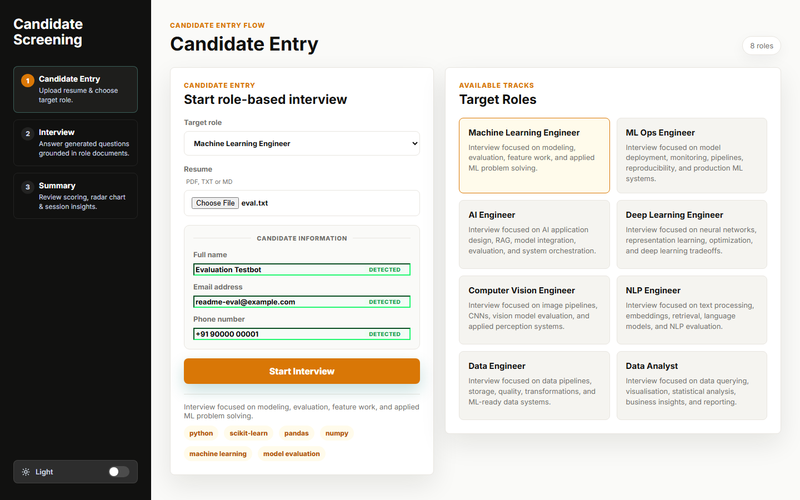
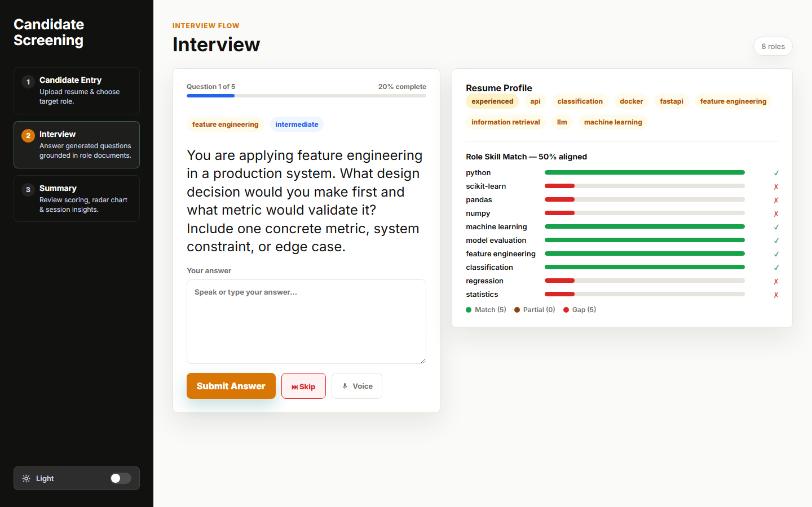
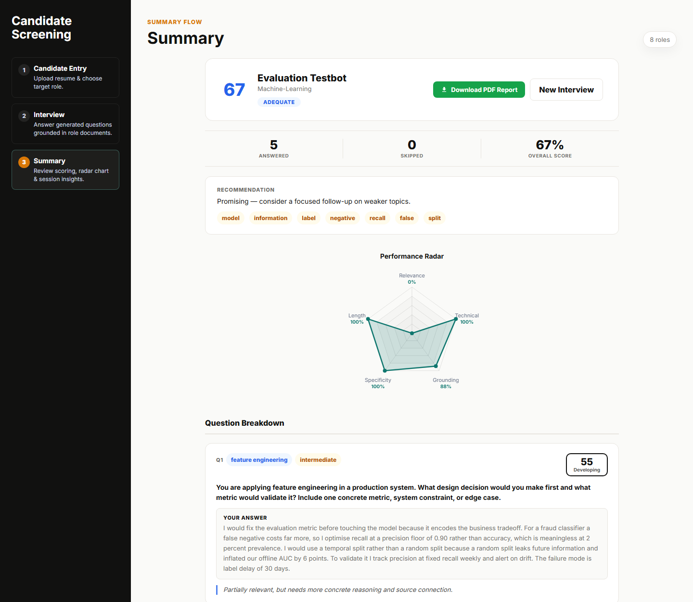
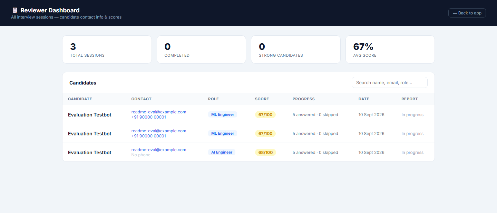

# Candidate Screening

An AI-assisted technical interview screener that parses a candidate's resume, generates role-specific questions grounded in a machine-learning knowledge base using retrieval-augmented generation, evaluates the answers, and produces a scored report for a reviewer.

**Live demo:** [adaptive-rag-interviewer.onrender.com](https://adaptive-rag-interviewer.onrender.com) · [Reviewer dashboard](https://adaptive-rag-interviewer.onrender.com/reviewer) · [API docs](https://adaptive-rag-interviewer.onrender.com/docs)

> Hosted on a Render free instance: the first request after idle takes 30–60 seconds to cold-start, and the SQLite database resets on restart.

---

## Screenshots

| Candidate entry | Interview |
|---|---|
|  |  |

| Summary | Reviewer dashboard |
|---|---|
|  |  |

---

## Overview

Screening technical candidates at volume is repetitive work: read a resume, invent role-appropriate questions, judge free-text answers, write a recommendation. This project automates that first pass.

1. **Upload a resume** (`.pdf`, `.txt`, or `.md`). Name, email, and phone are extracted automatically and fill the form.
2. **Select a target role** from eight AI/ML and data roles.
3. **Answer five questions.** Each is generated from passages retrieved out of a knowledge base of machine-learning textbooks, tailored to the skills found in the resume.
4. **Answers are scored 0–100** across five dimensions, with written feedback, strengths, and gaps.
5. **Review the results** — a session summary with a radar chart and per-question breakdown, a downloadable PDF report, and a dashboard listing every session.

Question difficulty adapts as the interview progresses, escalating to `advanced` once the running average passes 75.

---

## Key Features

- **Resume parsing** — layered validation (extension, MIME type, PDF magic bytes, word-count bounds), then regex extraction of name, email, and phone, plus skill and domain matching against a keyword taxonomy.
- **Role-specific interviews** — eight roles, each with a required-skill list used for a skill-gap breakdown (`match` / `partial` / `gap`).
- **RAG question generation** — questions are grounded in passages retrieved from the knowledge base, and the model reports which passages it used.
- **Deterministic retrieval** — the top-ranked chunks are passed downstream in rank order, so the same session state always produces the same context.
- **Answer evaluation** — Gemini grades correctness, relevance, completeness, reasoning, and grounding, and returns any factual errors it identifies.
- **Transparent evaluator provenance** — every stored analysis records whether it came from `gemini` or the local `heuristic` fallback. The two are never mixed silently.
- **Reviewer dashboard** — all sessions with contact details, scores, and progress, with search filtering.
- **PDF reports** — a ReportLab A4 summary, downloadable per session.
- **Evaluation harness** — reproducible scripts for retrieval, question generation, and answer scoring, plus a 23-check end-to-end regression suite.

---

## Architecture

```
Resume upload
      |  regex + keyword taxonomy (no LLM)
Candidate profile  -->  Role selection
      |
TF-IDF query  -->  retrieve 15 chunks  -->  keep ranked top 5
      |
Question generation  -->  Gemini (chunks + profile + prior questions)
      |                   `- unavailable? deterministic local generator
      |
Candidate answer
      |
Answer evaluation  -->  Gemini (question + same ranked chunks + expected points)
      |                  `- unavailable? local heuristic scorer
      |
Session summary  -->  radar chart | PDF report | reviewer dashboard
```

The ranked context used to build a question is stored alongside it and replayed to the evaluator, so an answer is graded against the material its question came from.

A single FastAPI process serves both the API and the frontend. There is no separate frontend server, no worker, and no vector database.

---

## RAG Implementation

**Knowledge base.** Machine-learning textbook PDFs organised into three collections (`ai-ml`, `data-science`, `advanced-ml`). The eight roles map onto these three collections.

**Ingestion.** Each PDF is read page by page up to `MAX_PAGES_PER_DOCUMENT` (default 60); files larger than `MAX_DOCUMENT_MB` (default 25) are skipped. Pages are split into 900-character chunks with 160-character overlap, snapping to a sentence boundary where one falls past 55% of the window. The default configuration yields **1,004 chunks across 360 indexed pages**.

**Retrieval.** `TfidfVectorizer(stop_words="english", max_features=18000, ngram_range=(1,2))` with cosine similarity — lexical matching, not embeddings. The index is built lazily on the first request per role (about 5 seconds) and cached in memory.

**Selection.** A query is composed from the role, seniority signal, resume keywords, and the previous answer. The retriever fetches `max(TOP_K * 3, 12)` = 15 candidates and keeps the **ranked top 5**. No sampling — the ordering the retriever produces is the ordering the generator receives.

**Provenance.** Chunks are passed to Gemini tagged `[S1]`–`[S5]` in rank order. The model returns the IDs it actually used, and each question row stores the generator, those source IDs, the expected answer points, and the rank, score, and page of every chunk.

---

## AI / Gemini

**Model:** `gemini-2.5-flash` via the `google-genai` SDK.

**Question generation** sends the role, resume-derived background, topic, target difficulty, up to five ranked chunks (600 characters each), and the questions already asked in the session. It returns structured JSON: the question, topic, difficulty, the source IDs used, and up to four expected answer points. It runs at `temperature=0.4`, and output is rejected in favour of the local generator if it is too short, leaks source markers, or closely duplicates an earlier question.

**Answer evaluation** sends the question, the same ranked reference context, the expected points, and the candidate's answer. It returns per-dimension scores for **correctness, relevance, completeness, reasoning, and grounding**, plus an overall score, level, feedback, strengths, gaps, and a list of factual errors found. It runs at `temperature=0.0` with a fixed seed. Correctness carries the most weight, and a deterministic rule in code caps the overall score at 35 when correctness falls below 25.

The scoring rubric is a design choice. It has not been calibrated against human expert ratings.

**Fallback.** The Gemini free tier allows five requests per minute, and one interview needs roughly ten calls, so the API can become unavailable mid-session. When that happens:

- **Question generation** falls back to a deterministic local generator that composes a question from the selected topic and a concept phrase extracted from the ranked retrieved chunks. It is not a language model and is labelled `local-grounded`.
- **Answer evaluation** falls back to a hand-designed heuristic that scores lexical features — answer length, topic overlap, overlap with the retrieved chunks, technical term density, and numeric specificity. It cannot judge factual correctness, and its result is always labelled `evaluator: "heuristic"`.

On the interactive path a rate-limited call fails over in under a second rather than waiting out the server's retry delay. Offline evaluation scripts use a patient retry profile instead.

---

## Evaluation

All figures below come from the reproducible harness in `evaluation/`, run against this repository's own corpus with seed `20260910`. Raw output is in `evaluation/results/`.

**Retrieval — known-item benchmark.** Ground truth is constructed rather than hand-labelled: a query is lifted verbatim from a chunk, and that chunk is by definition the relevant result. Single-gold, so Recall@K equals Success@K.

| Query type | n | Recall@1 | Recall@5 | MRR | nDCG@10 |
|---|---:|---:|---:|---:|---:|
| Keyword | 1,003 | 0.958 | 0.999 | 0.976 | 0.982 |
| Sentence | 983 | 0.834 | 0.983 | 0.906 | 0.927 |

This measures index and ranking health and is an upper bound on retrieval capability. It is **not** a measure of whether the chunks retrieved for a real interview query are topically appropriate — that needs human relevance judgements, which have not been collected. Blank annotation sheets for that study are generated by `evaluation/human_eval_template.py`.

**Question generation** — 480 questions across 96 simulated sessions using the local generator:

- Exact duplicate rate **15.4%**, 406 distinct questions
- **100%** of questions contain a concept phrase verifiably lifted from the retrieved chunks
- **0 of 96** sessions repeated a topic

**Answer scoring** — the local scorer is a pure function of its inputs: 7 benchmark answers, 20 repetitions each, produced a single distinct score per answer with a standard deviation of 0.

**Knowledge base** — 360 of 1,932 available pages indexed, **18.6% coverage** under the default page cap.

**End-to-end** — `evaluation/test_e2e.py` runs 23 checks covering resume parsing, session creation, the full five-question flow, summary generation, PDF export, reviewer data, scoring determinism, and fallback labelling. All 23 pass.

Agreement between the automated scorer and human experts (MAE, Spearman, quadratic weighted kappa) is **not reported** — no expert labels exist. The harness computes those metrics only once real labels are supplied.

---

## Tech Stack

- **Backend** — FastAPI, Uvicorn, Pydantic
- **AI** — Google Gemini 2.5 Flash via `google-genai`
- **Retrieval** — scikit-learn TF-IDF, NumPy
- **Parsing and reporting** — PyPDF2, ReportLab
- **Database** — SQLite (WAL mode, no ORM)
- **Frontend** — vanilla HTML, CSS, and JavaScript with Canvas 2D and the Web Speech API; no build step

---

## Project Structure

```
app/
  main.py                    FastAPI application and all routes
  config.py                  Settings loaded from environment
  database.py                SQLite schema, migrations, connection helper
  models.py                  Pydantic request/response models
  services/
    documents.py             Role tables, PDF to page to chunk pipeline
    retrieval.py             TF-IDF index and query builder
    resume.py                Resume validation and field extraction
    interview.py             Session flow, question generation, heuristic scorer
    gemini_eval.py           Gemini prompts, client, retry policy
    pdf_report.py            ReportLab report generator
static/
  index.html, app.js, styles.css    Candidate single-page app
  reviewer.html                     Reviewer dashboard
evaluation/
  eval_retrieval.py          Known-item retrieval benchmark
  eval_qgen.py               Question diversity and grounding
  eval_scorer.py             Answer-scorer behavioural tests
  human_eval_template.py     Annotation sheet generator and metric calculator
  test_e2e.py                End-to-end regression suite
  results/                   Benchmark output (JSON)
Knowledge Base Resources/    Source PDFs for the knowledge base
docs/screenshots/            README images
requirements.txt
Procfile
```

---

## Local Setup

Requires Python 3.10 or newer.

```bash
git clone https://github.com/shreddedlines/adaptive-rag-interviewer.git
cd adaptive-rag-interviewer
```

```bash
python -m venv .venv
.venv\Scripts\activate          # Windows
source .venv/bin/activate       # macOS / Linux
```

```bash
pip install -r requirements.txt
```

Create a `.env` file in the project root:

```
GEMINI_API_KEY=your_key_here
```

Optional overrides: `MAX_PAGES_PER_DOCUMENT`, `MAX_DOCUMENT_MB`, `TOP_K`, `CHUNK_SIZE`, `CHUNK_OVERLAP`, `DATABASE_PATH`, `KNOWLEDGE_BASE_PATH`.

Verify the key loads, without printing it:

```bash
python -c "from app.services.gemini_eval import availability; print(availability())"
```

Run the server:

```bash
python -m uvicorn app.main:app --reload --port 8000
```

- Application: <http://localhost:8000>
- Reviewer dashboard: <http://localhost:8000/reviewer>
- API docs: <http://localhost:8000/docs>

The database is created automatically on startup and the knowledge base is indexed on first use. No separate frontend build or process is required.

To run the evaluation harness:

```bash
python evaluation/eval_retrieval.py
python evaluation/eval_qgen.py
python evaluation/test_e2e.py     # requires a server running on port 8099
```

---

## Deployment

Deploys to Render as a single web service.

- **Build command:** `pip install -r requirements.txt`
- **Start command:** `uvicorn app.main:app --host 0.0.0.0 --port $PORT` (also defined in the `Procfile`)
- **Environment variable:** set `GEMINI_API_KEY` in the Render dashboard. Platform environment variables are read directly; a `.env` file is only needed locally.
- The `Knowledge Base Resources/` PDFs must be present in the deployed image, since the index is built from them at runtime.

On a free instance the container sleeps when idle and the filesystem is ephemeral, so `storage/app.db` is wiped on every restart or deploy. Use a managed Postgres instance for anything that needs to persist.

---

## Current Limitations

- **SQLite on ephemeral storage.** Session data does not survive a Render restart or redeploy.
- **Gemini free-tier rate limits.** Five requests per minute against roughly ten calls per interview means a session can fall back to the heuristic scorer partway through. The fallback is always labelled, never disguised.
- **The heuristic fallback cannot assess correctness.** It scores lexical surface features, so a fluent but factually wrong answer can score the same as a correct one. It is a triage aid, not a substitute for the model.
- **No authentication.** The reviewer dashboard and its API return candidate contact details to anyone who knows the URL. Do not expose a real deployment publicly as-is.
- **Knowledge-base coverage is 18.6%** of available pages under the default page cap. Raising it increases memory use; past roughly 120 pages per document the index no longer fits a 512 MB free instance.
- **Lexical retrieval only.** TF-IDF cannot match synonyms or paraphrase, which the roughly 12-point Recall@1 gap between keyword and sentence queries reflects.
- **Retrieval relevance for production queries is unmeasured.** Only the known-item benchmark has been run.
- **No hiring-outcome validation.** This has not been validated for real hiring decisions and should not be used to gate them.

---

## Future Improvements

- Embedding-based retrieval, benchmarked against the TF-IDF baseline on the same query set
- Human relevance and answer-scoring annotations, to compute nDCG and scorer agreement
- Authentication and access control for the reviewer dashboard
- Managed Postgres in place of SQLite
- Response caching and a paid API tier to remove mid-interview fallback
- Wiring the regression suite into CI

---

## License and Knowledge Base Notice

The `Knowledge Base Resources/` directory contains third-party machine-learning textbooks in PDF form. **These are copyrighted works owned by their respective authors and publishers. They are not mine, are included only for local development, and are not licensed for redistribution.**

Before making this repository public or redistributing it, replace them with public-domain, openly licensed, or self-authored documents. The ingestion pipeline is format-agnostic: drop replacement PDFs into the same three role folders and the index rebuilds on the next run.

The application code is available for review as a portfolio project.
