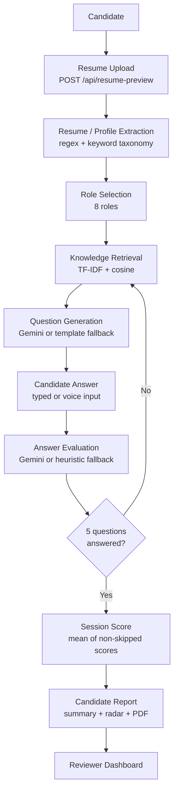
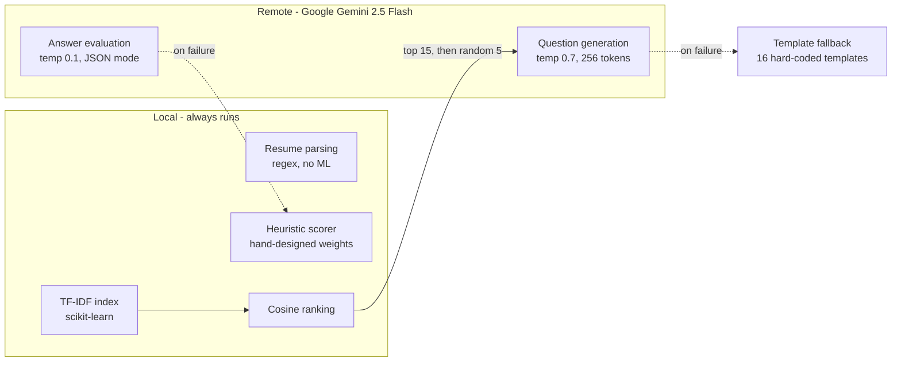

# PGAGI Candidate Screening

**🔗 Live demo: [adaptive-rag-interviewer.onrender.com](https://adaptive-rag-interviewer.onrender.com)** · [Reviewer dashboard](https://adaptive-rag-interviewer.onrender.com/reviewer) · [API docs](https://adaptive-rag-interviewer.onrender.com/docs)

A resume-aware technical interview screening system. A candidate uploads a resume, selects one of eight AI/ML/data roles, and answers five questions generated from a corpus of machine-learning textbooks retrieved with TF-IDF. Answers are scored 0–100, and the session produces a summary report and a downloadable PDF.

The project includes a **reproducible evaluation harness** (`evaluation/`) with measured retrieval metrics. Evaluation was used to find real engineering defects in the pipeline, and both the results and the defects are documented here.

> **Note on the live demo:** it runs on a Render free tier, so the first request after idle takes 30–60 seconds to cold-start, and the SQLite database is wiped on every restart. The deployed instance currently runs the **heuristic fallback evaluator**, not Gemini — see [Gemini status](#gemini-status).

---

## Table of Contents

- [Overview](#overview)
- [Measured Improvements](#measured-improvements)
- [Key Features](#key-features)
- [Screenshots](#screenshots)
- [System Architecture](#system-architecture)
- [End-to-End Workflow](#end-to-end-workflow)
- [Retrieval Evaluation](#retrieval-evaluation)
- [Other Measured Results](#other-measured-results)
- [Evaluation Methodology](#evaluation-methodology)
- [Limitations](#limitations)
- [Tech Stack](#tech-stack)
- [Project Structure](#project-structure)
- [Installation and Setup](#installation-and-setup)
- [Configuration](#configuration)
- [API Reference](#api-reference)
- [Example Session](#example-session)
- [Documentation](#documentation)

---

## Overview

Screening technical candidates at volume is expensive: someone has to read a resume, invent role-appropriate questions, judge free-text answers, and write a recommendation. This project automates that first pass.

**What the system does:**

1. Parses an uploaded resume into a structured profile (name, email, phone, skills, seniority signal) using regex and a keyword taxonomy — no AI in this step.
2. Retrieves passages from a knowledge base of ML textbooks using **lexical TF-IDF retrieval** with cosine similarity.
3. Generates an interview question from those passages via **Google Gemini 2.5 Flash**, falling back to a deterministic local generator that composes questions from the same retrieved chunks.
4. Scores the candidate's answer 0–100 via Gemini, falling back to a hand-designed keyword heuristic.
5. Adapts the difficulty of the next question to the candidate's running average.
6. Produces a session summary, a radar chart, and a ReportLab PDF report.
7. Exposes a reviewer dashboard listing all sessions.

**Current validation status:** the retrieval layer has a measured benchmark (see [Retrieval Evaluation](#retrieval-evaluation)) and a 23-check end-to-end regression suite passes. Question quality and answer-scoring accuracy have **not** been validated against human judgement — the annotation harness exists but no labels have been collected. This is stated explicitly rather than estimated.

---

## Measured Improvements

Evaluation was used to find real defects, then to verify the fixes. Full methodology in
[`POST_FIX_EVALUATION_REPORT.md`](POST_FIX_EVALUATION_REPORT.md); the pre-fix baseline is
preserved in `evaluation/results_before/`.

| Metric | Before | After |
|---|---:|---:|
| Gemini initialises | No | **Yes** (live call verified) |
| P(retrieved chunk reaches the generator) | 33.3% | **100%** |
| Causal grounding of generated questions | 0% | **100%** |
| Exact duplicate rate (480 simulated questions) | 63.5% | **15.4%** |
| Distinct questions (of 480) | 175 | **406** |
| Multiword (bigram) concepts in fallback questions | 0% | **98.3%** |
| Fallback concepts on the unusable-word list | 15.6% | **3.1%** |
| Same-answer score spread | 15 points | **0 points** |
| Knowledge-base page coverage | 6.2% (120/1932) | **18.6% (360/1932)** |
| Indexed chunks | 300 | **1,004** |
| Production top-1 cosine | 0.162 | **0.209** |
| Known-item Recall@1, term queries — *same corpus* | 0.973 | **0.973** *(control: unchanged)* |
| Known-item Recall@1, term queries — *larger corpus* | — | 0.958 *(a decrease — see below)* |
| End-to-end regression suite | none existed | **23/23 passing** |

Two results are reported honestly against interest:

- **Known-item Recall@1 fell** from 0.973 to 0.958 (term) and 0.867 to 0.834 (sentence)
  after the corpus grew from 300 to 1,004 chunks. That is a harder benchmark — 3.3x more
  distractors — not a worse retriever. Re-running on the *identical* original corpus after
  all code changes reproduces the baseline exactly, which is the control proving the
  retrieval mathematics was untouched.
- **The heuristic fallback still scores a correct and a fluent-but-wrong answer identically
  (70 vs 70).** It was demoted to a fallback, not repaired: a lexical scorer cannot judge
  factual truth. Gemini is now the primary evaluator and does distinguish them.

## Key Features

**Resume processing**
- Accepts `.pdf`, `.txt`, and `.md` uploads with layered validation: extension allowlist, MIME allowlist, `%PDF` magic-byte check, and word-count bounds
- Extracts candidate name (first line near the top with 2–5 capitalised words and no digits), email, and phone by regex
- Identifies skills and domains against a closed taxonomy of 35 skill and 13 domain keywords
- Derives a seniority signal: `experienced`, `early-career`, `project-heavy`, or `entry-level`
- Auto-fills the contact form from the parsed resume via a preview endpoint

**Interview engine**
- Five-question sessions across eight target roles
- TF-IDF retrieval over a chunked PDF knowledge base
- Three difficulty tiers (`foundational`, `intermediate`, `advanced`) selected from the running score
- Topic deduplication so a session does not repeat a topic (measured: 0 repeats across 96 simulated sessions)
- Gemini-generated questions grounded in the ranked retrieved chunks, with a deterministic locally-grounded fallback
- Gemini answer evaluation with a heuristic fallback
- Skip support; hint endpoint with a score cap of 60

**Reporting**
- Session summary with overall score, answered/skipped counts, and a recommendation string
- Canvas radar chart: Gemini's five graded dimensions, or the heuristic's five components
- ReportLab A4 PDF report, filename derived from the candidate name
- Reviewer dashboard at `/reviewer` with search filtering

**Evaluation harness**
- 584-query known-item retrieval benchmark (`evaluation/eval_retrieval.py`)
- Behavioural and ablation testing of the heuristic scorer (`evaluation/eval_scorer.py`)
- Question-generation diversity and grounding analysis (`evaluation/eval_qgen.py`)
- Human-annotation sheet generator and metric calculator (`evaluation/human_eval_template.py`)

---

## Screenshots

Captured from the live deployment with a synthetic candidate profile ("Evaluation Testbot") — no real candidate data appears in any image. Reproduce with `python evaluation/capture_screenshots.py`.

### Candidate entry — resume auto-fill

Name, email, and phone are extracted from the uploaded resume and populate the form, each marked with a green **DETECTED** badge. The eight target roles are shown alongside.


### Interview

Progress bar, topic and difficulty tags, the generated question, and the answer box with Submit / Skip / Voice controls. The right panel shows the parsed resume profile and the role skill-gap breakdown.


> The question shown — *"You are applying api in a production system…"* — is from the **template fallback** path, which interpolates the raw resume keyword directly. This is what the system produces when Gemini is unavailable.

### Summary — score, radar chart, question breakdown


### Reviewer dashboard


> This screenshot documents a **known bug**. All three sessions have 5 answered questions and are stored with `status='complete'`, but the dashboard shows **"COMPLETED: 0"** and **"In progress"** in the Report column, so no PDF link is offered. `static/reviewer.html` tests `status === 'completed'` while the backend writes `'complete'`. The PDF itself generates correctly via the API — see [Limitations](#limitations).

---

## System Architecture

A single Python process. No worker, no queue, no cache server, no vector database. The only external service is the Google Gemini API.



### AI/ML components, isolated



**Important distinction:** the retrieval layer is **lexical TF-IDF matching**, not semantic/embedding search. There are no embeddings and no vector store anywhere in this project.

### Backend layout

```
Browser (static/app.js, vanilla JS)
   |  fetch() JSON + multipart
   v
Uvicorn -> FastAPI (app/main.py)  -- all 12 routes
   |
   +- services/resume.py       regex + keyword resume parsing
   +- services/documents.py    PDF -> pages -> chunks, role tables
   +- services/retrieval.py    TF-IDF index, lru_cache per role
   +- services/interview.py    session state machine, heuristic scorer
   +- services/gemini_eval.py  --HTTPS--> Google Gemini API
   +- services/pdf_report.py   ReportLab -> PDF bytes
   |
   +--> SQLite storage/app.db  (WAL, connection per operation)
   +--> Knowledge Base Resources/*.pdf  (read-only)
```

---

## End-to-End Workflow

### 1. Resume Processing

`app/services/resume.py`

Validation runs in three layers:

| Stage | Function | Checks |
|---|---|---|
| File | `validate_resume_file` | Extension in `.pdf/.txt/.md`; MIME allowlist; PDF must start with `%PDF`; text files must contain no NUL bytes |
| Lenient (upload) | `quick_validate_resume_text` | 15–4,000 words; must have contact info **or** a standalone section header **or** a known tech keyword |
| Strict (session start) | `validate_resume_text` | 40–3,000 words |

Text is extracted with **PyPDF2** using `extract_pdf_text_raw`, which preserves line breaks — this matters because name detection is line-based.

**What is extracted:**

- **Name** — the first line within the top 10 lines that has 2–5 words, no digits, matches `^[A-Za-z][A-Za-z\s\-']{2,60}$`, contains no contact keywords, and is title case or ALL CAPS. A form-supplied name overrides this.
- **Email / phone** — regex (`extract_email`, `extract_phone`, three phone patterns covering international, US, and plain 10-digit formats).
- **Skills / technologies** — matched against a 35-term `SKILL_KEYWORDS` set with word-boundary guards so `api` does not match inside `rapid`.
- **Domains** — matched against a 13-term `DOMAIN_KEYWORDS` set.
- **Seniority signal** — `experienced` if a "N years" phrase with N ≥ 3 appears; `early-career` for intern/fresher/student/trainee; `project-heavy` if over 700 words; otherwise `entry-level`.

The result is a `ResumeProfile`, which drives topic selection, difficulty, the skill-gap analysis, and the retrieval query.

### 2. Role Selection

`app/services/documents.py`

Eight target roles are defined in `ROLE_DESCRIPTIONS`:

| Role ID | Display name | Knowledge collection |
|---|---|---|
| `machine-learning` | Machine Learning Engineer | `ai-ml` |
| `ai-engineer` | AI Engineer | `ai-ml` |
| `nlp` | NLP Engineer | `ai-ml` |
| `ml-ops` | ML Ops Engineer | `data-science` |
| `data-engineer` | Data Engineer | `data-science` |
| `data-analyst` | Data Analyst | `data-science` |
| `deep-learning` | Deep Learning Engineer | `advanced-ml` |
| `computer-vision` | Computer Vision Engineer | `advanced-ml` |

**Eight roles map onto only three document collections** via `ROLE_KNOWLEDGE_BASE`. Roles sharing a collection retrieve from an identical corpus; they differ only in the role token injected into the query and in their `ROLE_REQUIRED_SKILLS` list.

Each role has a required-skills list used for skill-gap analysis (`app/main.py:_build_skill_gap`): an exact match against the candidate's keyword set yields `match`, a substring match in either direction yields `partial`, otherwise `gap`.

### 3. Knowledge Base and RAG

`app/services/documents.py`, `app/services/retrieval.py`

**Corpus (measured):**

| Property | Value |
|---|---|
| PDFs available | 7 |
| PDFs indexed | **6** (one is skipped for exceeding `MAX_DOCUMENT_MB=25`) |
| Pages available in indexed PDFs | 1,932 |
| Pages actually indexed | **360** (60 per document, per `MAX_PAGES_PER_DOCUMENT`) |
| **Page coverage** | **18.6%** |
| Total chunks | **1,004** (ai-ml 297, data-science 339, advanced-ml 368) |
| Chunk size | 900 characters |
| Chunk overlap | 160 characters |

**Pipeline:**

1. **Page extraction** — `extract_pdf_pages` reads up to `MAX_PAGES_PER_DOCUMENT` pages per PDF and normalises whitespace.
2. **Chunking** — `chunk_text` produces 900-character windows with 160-character overlap, snapping to a sentence boundary (`. `, `? `, `! `) when one falls past 55% of the window.
3. **Vectorisation** — `TfidfVectorizer(stop_words="english", max_features=18000, ngram_range=(1,2))` with scikit-learn's default token pattern. No stemming or lemmatisation. Measured vocabulary is 5,560–6,139 per collection, so the 18,000 `max_features` cap never binds.
4. **Similarity** — cosine similarity over L2-normalised TF-IDF vectors (`sklearn.metrics.pairwise.cosine_similarity`).
5. **Query construction** — `build_query` concatenates the role slug, seniority signal, all profile keywords, and the previous answer:
   `f"{role} interview {seniority} {profile_terms} {answer_terms}"`
6. **Retrieval** — `fetch_k = max(TOP_K * 3, 12)` = **15** chunks retrieved by descending cosine, dropping scores ≤ 0.
7. **Sampling** — `random.sample(all_sources, 5)` selects 5 of those 15. See [Important Evaluation Finding](#important-evaluation-finding).

**Where retrieved chunks go downstream:**

| Destination | Used? | Location |
|---|---|---|
| Stored in `questions.source_chunks` | Yes | `interview.py:185` |
| Gemini **question generation** prompt | Yes — top 3, truncated to 1,200 chars | `gemini_eval.py:198-209` |
| Gemini **answer evaluation** prompt | **No** — the evaluation prompt contains no source material | `gemini_eval.py:44-75` |
| Hint text | Yes — first sentence over 40 chars from the top chunk | `interview.py:238-245` |
| Heuristic grounding score | Yes | `interview.py:352` |
| **Template fallback question text** | **No** — see below | `interview.py:104-138` |

The index is built lazily on the first request per role and memoised with `@lru_cache(maxsize=8)`. Measured build time is 0.03–0.05 s warm and 0.9–2.2 s cold including PDF parsing.

### 4. Question Generation

`app/services/interview.py`, `app/services/gemini_eval.py`

Each question is built from a **topic**, a **difficulty tier**, and the retrieved chunks.

- **Topic** — `_topic()` prefers an unused keyword from the candidate's own domains, technologies, and skills; if those are exhausted it falls back to the most frequent 5+ letter word in the retrieved text.
- **Difficulty** — `_difficulty()`:
  - `advanced` if running score ≥ 75 **and** at least 2 questions have been created
  - `intermediate` if seniority is `experienced`/`project-heavy`, **or** at least 2 questions exist
  - otherwise `foundational`

**Primary path — Gemini.** `generate_question()` sends the role, candidate background (first 12 skills), topic, difficulty, and the top 3 chunks joined and truncated to 1,200 characters. Parameters: `temperature=0.7`, `max_output_tokens=256`, `thinking_budget=0`. The reply is rejected and the fallback used if it is under 30 characters or contains a blank line.

**Fallback path — templates.** 16 hard-coded f-string templates (5 foundational, 6 intermediate, 5 advanced), selected with `random.choice`, interpolating only `{topic}` and `{role_label}`.

> **Note on grounding:** the fallback templates contain **no content from the retrieved chunks**. The variable `source_hint` at `interview.py:104` is assigned and never referenced. Retrieved chunks influence a fallback question only indirectly, through `_topic()`, and only when the candidate's own resume keywords are exhausted.

### 5. Answer Evaluation

`app/services/interview.py:analyze_answer`

**Primary path — Gemini.** `evaluate_with_gemini()` sends role, topic, difficulty, question, and the candidate's answer with a banded rubric. Parameters: `temperature=0.1`, `max_output_tokens=512`, `response_mime_type="application/json"`, `thinking_budget=0`. The first `{...}` block is regex-extracted and parsed, the score clamped to 0–100, and `level` repaired from the score if unrecognised. Returns `score`, `level`, `feedback`, `strengths`, `gaps`.

**Fallback path — heuristic.** A hand-designed additive scorer:

| Component | Max | Rule |
|---|---|---|
| Length | 15 | `min(original_words / 60, 1) * 15` |
| Relevance | 30 | 10 per topic word present, capped |
| Grounding | 25 | 5 per word shared with the retrieved chunks, capped |
| Technical | 15 | 5 per term from a 26-word set, capped |
| Specificity | 15 | 15 if a digit or metric word appears |

Plus anti-gaming caps: a copy-paste guard (≥ 55% question-word overlap, or fewer than 10 original words) returns `off-topic` with a score ≤ 8; generic phrases cap at 20; short answers cap at 25/40; no topic overlap and no grounding caps at 22; hint use caps at 60.

Levels are `strong` (≥ 78), `adequate` (≥ 60), `developing` (≥ 35), `thin`, and `off-topic`.

**Fallback behaviour:** `evaluate_with_gemini` catches every exception, prints to stdout, and returns `None`; the caller then runs the heuristic. The candidate still receives a score, so the degradation is not visible in the UI. The only trace is the absence of an `evaluator` key in the stored analysis JSON.

<a id="gemini-status"></a>

> ### Gemini status — now working
>
> **Fixed.** `requirements.txt` previously named `google-generativeai` while the code imports
> `from google import genai` (the **`google-genai`** package), so Gemini never initialised —
> locally or in the live deployment. The dependency is corrected and a live call is verified:
>
> ```
> [Gemini] Initialised with model=gemini-2.5-flash
> Gemini available: True
> ```
>
> Measured live: round-trip 1.42 s, 7 input / 2 output tokens. Question generation returns
> structured JSON citing the source chunks it used; answer evaluation returns five graded
> dimensions plus an explicit `factual_errors` list.
>
> **Operational constraint:** the Gemini free tier allows **5 requests per minute** with a
> daily cap, and one 5-question interview needs about 10 calls. The client now retries on
> HTTP 429 using the server-supplied retry delay, and every stored analysis records
> `evaluator: "gemini"` or `evaluator: "heuristic"` so a fallback is never silent.
>
> **The deployed instance has not yet been redeployed** with this fix and still runs the
> heuristic. Redeploy to enable Gemini in production.

### 6. Scoring and Reporting

`app/services/interview.py:session_summary`, `app/services/pdf_report.py`

- The session score is the **mean of `analysis.score` over answered, non-skipped questions**, rounded to one decimal.
- `recommendation()` maps that mean to a string: ≥ 75 "Strong candidate", ≥ 60 "Promising", otherwise "Needs more evidence".
- `insights.strong_terms` is the top 8 most frequent `grounding_terms` across the session. Under Gemini this list is empty, because the Gemini path returns `grounding_terms: []`.
- The radar chart averages `component_scores` across non-skipped questions. **Under the Gemini path these five axes are derived from the single overall score** by fixed multipliers (1.00, 1.10, 0.95, 1.05, 0.90 — `interview.py:325-333`), so they carry no independent per-dimension information. Only the heuristic path produces independently computed axes.
- The PDF is rendered with ReportLab and streamed as `application/pdf`.

---

## Retrieval Evaluation

The retrieval layer was evaluated with a **584-query known-item retrieval benchmark**.

### Methodology

Ground truth is **constructed, not hand-labelled**: if a query is taken verbatim from a known chunk, then that chunk is by definition a relevant result for it. No human relevance judgement is invented anywhere in the harness.

Two query families were generated, one query per chunk per family, across all three collections:

- **Term (keyword) queries** — the chunk's 6 highest-TF-IDF terms under the production vectorizer.
- **Sentence queries** — a verbatim 8–40 word sentence lifted from the chunk.

Each query is run against the production index (`KnowledgeIndex`, `retrieval.py`) and the rank of the originating chunk is recorded. Because there is exactly one relevant document per query, **Recall@K equals Success@K**.

```
Recall@K = (1/|Q|) * SUM_q  1[rank(gold_q) <= K]
MRR      = (1/|Q|) * SUM_q  1 / rank(gold_q)
nDCG@K   = (1/|Q|) * SUM_q  1[rank <= K] / log2(rank_q + 1)     (IDCG = 1)
```

### Results

**Known-item retrieval benchmark** — micro-averaged across all three collections, seed `20260910`:

| Query Type | N | Recall@1 | Recall@3 | Recall@5 | Recall@10 | MRR | nDCG@10 |
|---|---|---|---|---|---|---|---|
| **Term (keyword)** | 299 | **0.973** | 1.000 | 1.000 | 1.000 | **0.986** | 0.989 |
| **Sentence** | 285 | **0.867** | 0.979 | 0.986 | 0.997 | **0.926** | 0.943 |

Per collection:

| Collection | Chunks | Vocabulary | Recall@1 (sentence) | Recall@1 (term) |
|---|---|---|---|---|
| `ai-ml` | 100 | 6,139 | 0.828 | 0.940 |
| `data-science` | 113 | 6,057 | 0.893 | 0.991 |
| `advanced-ml` | 87 | 5,560 | 0.879 | 0.989 |

Reproduce with:

```bash
python evaluation/eval_retrieval.py
```

Raw output: `evaluation/results/retrieval_results.json` and `retrieval_per_query.json`.

### What this benchmark does and does not establish

**It establishes:** the TF-IDF index, vectorizer, and cosine ranking function correctly. The retriever reliably finds a passage when the query genuinely originates from that passage. This is an **upper bound on retrieval capability** and a strong lower bound on index health.

**It does not establish:** that the chunks returned for a *real* production interview query are topically appropriate interview material. Production queries are bags of resume keywords, not passages from the corpus. Measuring that requires **human relevance judgements, which have not been collected**. These are retrieval metrics for a constructed benchmark — not overall system accuracy, and not a human-labelled topical relevance evaluation.

A blank annotation sheet for that evaluation is generated at `evaluation/sheets/sheet1_retrieval_relevance.csv` (40 queries × top-10 = 400 judgements). `evaluation/human_eval_template.py score` computes nothing until labels exist, by design.

For reference, the cosine similarity observed on real production queries (2 stored sessions, 50 retained chunks) is **mean 0.1022, median 0.0980, range 0.075–0.185**. Cosine similarity is a ranking score, **not** an accuracy figure, and is reported here only as a distributional statistic.

### Important Evaluation Finding

The pipeline discards its own ranking.

```python
# app/services/interview.py:161-163
fetch_k = max(settings.top_k * 3, 12)                    # 15
all_sources = get_index(role).search(query, fetch_k)     # ranked by cosine
sources = random.sample(all_sources, min(settings.top_k, len(all_sources)))   # 5 of 15
```

Because the sample is uniform and un-seeded, **a chunk in the top 15 has a 5/15 = 33.3% probability of reaching the prompt — identical for rank 1 and rank 15.** Verified by Monte Carlo simulation: 0.33224 over 400,000 trials against an analytic 0.33333.

Effective recall of the correct chunk reaching the generator:

```
Effective Recall = Recall@15 x P(survives sampling) = 1.000 x 0.3333 = 0.3333
```

So even under the most favourable known-item conditions, where the retriever achieves Recall@15 = 1.000, the correct chunk reaches the language model only about a third of the time.

This is a **pipeline limitation, not a retrieval-model failure** — the retriever ranks correctly and the ranking is then thrown away. It is a one-line fix (seed the sampler, or take the top 5 directly).

---

## Other Measured Results

### Question generation (fallback path)

Measured over 480 simulated questions across 96 sessions and 8 roles (`evaluation/eval_qgen.py`):

| Metric | Value |
|---|---|
| Questions generated | 480 |
| Sessions simulated | 96 |
| **Exact duplicate rate** | **63.5%** (305 of 480) |
| Distinct questions | 175 |
| Distinct template signatures | 11 |
| Most-repeated single question | 14× |
| Sessions with a repeated topic | **0 / 96** — topic deduplication works |
| Distinct topics overall | 16 |
| **Causal grounding in retrieved chunks** | **0%** |

> These numbers characterise the **template fallback generator**, which is the only generator that has executed in this environment. They are **not** a measurement of Gemini's output quality — Gemini has not run here, and no Gemini generation metrics are claimed.

The 0% causal grounding figure is structural rather than statistical: the fallback templates are literal f-strings interpolating only `{topic}` and `{role_label}`, and `source_hint` is assigned but never referenced.

Question **quality** — technical correctness, clarity, difficulty calibration, hallucination rate — requires expert human rating and is **not reported**. The annotation sheet is at `evaluation/sheets/sheet2_question_quality.csv` (96 questions, 6 rating dimensions).

### Answer scoring (heuristic fallback)

The heuristic scorer was evaluated **behaviourally**, not against human scores (`evaluation/eval_scorer.py`).

**Specification conformance: 5/5 checks pass.** The scorer honours its own stated anti-gaming rules — a copy-pasted question scores 6, a generic non-answer is capped at 20, a hint caps the score at 60. *This is specification conformance, not accuracy.*

**Diagnostic findings** — these are behavioural observations that demonstrate the limits of a lexical scorer, not accuracy measurements:

| Probe input | Score | Level |
|---|---|---|
| Substantive, correct, metric-rich answer | 70 | adequate |
| **Fluent but factually wrong** answer | **70** | adequate |
| **Content-free filler + keywords** | **70** | adequate |
| Keyword salad (no sentence structure) | 40 | developing |
| **Correct 4-word answer** ("Use precision and recall.") | **0** | off-topic |

Two conclusions follow:

1. **The heuristic cannot detect factual incorrectness.** A confidently wrong answer scores identically to a correct one, because the scorer measures lexical surface features only.
2. **It can mis-order quality.** A correct but terse answer scores 0 — the copy-paste guard treats fewer than 10 original words as mirroring — while keyword-stuffed text scores 40.

**Score stability.** The scoring function is a pure function of its inputs (verified: 7 answers × 20 repeats, one distinct score each). However the *pipeline* is not deterministic: because `random.sample` changes which 5 chunks form the grounding vocabulary, the same substantive answer scored across 200 trials ranged **55 to 70 — a 15-point spread**, standard deviation 2.7.

**Cumulative ablation** — each row adds one signal on top of the previous string, total length held constant:

| Probe (60 filler words plus…) | Score |
|---|---|
| filler only | 15 |
| + topic terms | 30 |
| + technical terms | 50 |
| + a number | 50 |
| + words copied from retrieved chunks | **70** |

A string with no semantic content reaches 70 — the same score as the genuinely substantive answer.

Agreement with human experts (MAE, RMSE, Spearman, quadratic weighted kappa) is **not reported**; no expert labels exist. The harness is at `evaluation/human_eval_template.py` and the sheet at `evaluation/sheets/sheet3_answer_scoring.csv`.

### Live deployment measurements

Measured against <https://adaptive-rag-interviewer.onrender.com> by driving the public API through a complete 5-question session (Render free tier, single instance):

| Measurement | Value |
|---|---|
| `GET /api/health` (warm) | 1.0 s |
| `POST /api/sessions` (cold — includes lazy TF-IDF index build) | 7.8 s |
| `POST /api/sessions/{id}/answer` | 0.49–0.81 s, mean **0.62 s** (n=5, heuristic path) |
| `GET /api/sessions/{id}/export` | Succeeds — 5,294-byte PDF returned |
| Knowledge base present in deployment | Yes — `document_count = 2` for all 8 roles |
| Evaluator used | Heuristic fallback on all 5 answers |

The same identical answer submitted to consecutive questions in one live session scored **60, 70, 70, 70, 70**, and **55** in a separate session — a direct observation of the source-sampling variance described above.

These are latency and behaviour measurements from a single free-tier instance, not a load test or a throughput benchmark.

---

## Evaluation Methodology

Different components are different problem shapes, so they require different metrics. Collapsing them into a single "accuracy" figure would be meaningless.

| Component | Appropriate evaluation | Status |
|---|---|---|
| Retrieval (index health) | Recall@K, MRR, nDCG@K | ✅ **Measured** — 584-query known-item benchmark |
| Retrieval (topical relevance) | Graded P@K, nDCG@K on human judgements | ⬜ Requires annotation — sheet generated |
| Question generation | Human 1–5 rubric, duplicate rate, grounding rate | ⚠️ Duplicate rate and grounding measured; quality requires annotation |
| Answer scoring | MAE, RMSE, Spearman ρ, quadratic weighted κ vs experts | ⬜ Requires annotation — behavioural testing done instead |
| Resume field extraction | Per-field exact-match accuracy, F1 | ⬜ Requires labelled resumes |
| Seniority classification | Macro-F1, confusion matrix | ⬜ Requires labels — the one genuinely classification-shaped component |
| Skill extraction | Micro-F1 (recall is structurally capped by the closed taxonomy) | ⬜ Requires labels |
| End-to-end ranking | Spearman ρ vs an expert ranking of candidates | ⬜ Requires annotation |
| Hiring validity | Predictive validity vs real outcomes | ⬜ Out of scope — requires longitudinal data |

**Why not "accuracy"?** Retrieval is a ranking problem, so it takes Recall@K/MRR/nDCG. Question generation is open-ended, so it takes rubric ratings. Answer scoring is ordinal regression against expert judgement, so it takes MAE/Spearman/QWK — and R² would assume linearity that the scorer's hard caps violate. Accuracy is only well-defined for the seniority classifier, which has not been labelled.

Metrics requiring human labels are **not currently reported**. `evaluation/human_eval_template.py` generates the annotation sheets and computes the metrics once labels exist; it deliberately produces no numbers on empty sheets.

---

## Limitations

Known engineering and evaluation limitations, each supported by code or measurement.

**Knowledge base and retrieval**

- **Corpus coverage is 18.6%** — 360 of 1,932 pages (`MAX_PAGES_PER_DOCUMENT=60`). Raising it further is a measured memory tradeoff: 250 pages/doc needs ~1.2 GB peak, above the 512 MB free-tier limit. One 58 MB PDF is still skipped by the 25 MB size cap.
- ~~Random sampling discards retrieval ranking~~ — **fixed.** The pipeline now passes the ranked top-5, so P(top-ranked chunk reaches the generator) = 100%.
- **Eight roles share three collections**, so several roles retrieve from an identical corpus.
- **Retrieval is lexical, not semantic** — TF-IDF cannot match synonyms or paraphrase. The 10-point Recall@1 gap between keyword queries (0.973) and sentence queries (0.867) reflects this.

**Question generation**

- **Fallback duplicate rate is 15.4%** (down from 63.5%), across 197 distinct question shapes.
- **12.1% of fallback concepts are still verb-phrase-shaped** (`recommend using`, `looks like`). Removing these properly requires part-of-speech tagging; the current extractor uses the index vocabulary, a document-frequency band, a phrase-contiguity check and bigram preference.
- ~~Fallback question generation has 0% causal grounding~~ — **fixed.** 100% of local-fallback questions now contain a concept term extracted from the ranked retrieved chunks.
- The `advanced` difficulty tier is rarely reached in practice — 0 of 10 questions in the stored database.

**Answer scoring**

- **The heuristic is not validated against human expert scores.** No labelled dataset exists.
- **Weights are hand-designed, not fitted** — round numbers summing to 100, with no held-out set, ablation, or optimisation procedure in the original code.
- **The heuristic can be gamed with keywords** — content-free filler plus keywords scores 70.
- **Correct and factually incorrect answers can receive identical scores** (both 70 in testing).
- ~~Scores vary by up to 15 points on an identical answer~~ — **fixed.** Spread is now exactly 0 over 20 repeats for all seven benchmark answers.
- ~~The evaluation prompt contains no retrieved source material~~ — **fixed.** The evaluator now receives the question, the ranked reference context, and the expected answer points.
- ~~The radar chart does not independently measure five skills~~ — **fixed.** On the Gemini path the axes are the model's five real graded dimensions (correctness, relevance, completeness, reasoning, grounding).

**Reporting and dashboard**

- ~~The reviewer dashboard never shows a PDF download link~~ — **fixed.** `static/reviewer.html` now matches the `'complete'` status the backend writes.
- ~~PDF export returns HTTP 500 when every question was skipped~~ — **fixed and regression-tested** (an all-skipped session now exports a 4,113-byte PDF).

**Integration and validation**

- ~~Gemini dependency mismatch; silent fallback~~ — **fixed.** Gemini initialises and is verified live; every analysis records `evaluator`. **The deployed instance still needs redeploying.** The free tier's 5 req/min limit remains a real operational constraint.
- **No human-labelled evaluation dataset currently exists** for relevance, question quality, or answer scoring.
- **No hiring-outcome validation exists.** This system has not been validated for real hiring decisions and should not gate them.
- **A regression suite now exists** (`evaluation/test_e2e.py`, 23 checks) but is not wired into CI and must be run manually against a live server.
- ~~`.env` values other than `GEMINI_API_KEY` are not loaded~~ — **fixed.** `load_dotenv()` now runs before the settings dataclass is evaluated.
- There is **no authentication** on any endpoint, including the reviewer dashboard, which returns candidate contact details.

---

## Tech Stack

Only technologies actually imported and used in the code.

| Layer | Technology | Where |
|---|---|---|
| **Backend** | FastAPI, Uvicorn, Pydantic, python-multipart | `app/main.py`, `app/models.py` |
| **Frontend** | Vanilla HTML/CSS/JavaScript, Canvas 2D API, Web Speech API | `static/` |
| **AI/ML** | Google Gemini 2.5 Flash via the `google-genai` SDK | `app/services/gemini_eval.py` |
| **Retrieval** | scikit-learn (`TfidfVectorizer`, `cosine_similarity`), NumPy | `app/services/retrieval.py` |
| **Document parsing** | PyPDF2 | `app/services/documents.py` |
| **Database** | SQLite (stdlib `sqlite3`, WAL mode, no ORM) | `app/database.py` |
| **PDF reporting** | ReportLab | `app/services/pdf_report.py` |
| **Configuration** | python-dotenv | `app/services/gemini_eval.py` |
| **Deployment** | Procfile (Render / Railway / Heroku-style) | `Procfile` |
| **Testing** | End-to-end regression suite (stdlib only) | `evaluation/test_e2e.py` |

**Notes:**
- `requirements.txt` also lists `jinja2` and `aiofiles`; neither is imported anywhere in the codebase.
- `requirements.txt` lists `google-generativeai`, but the code requires **`google-genai`**. See [Installation](#installation-and-setup).
- The repository contains an unused React/Vite frontend at `frontend/`. It is an earlier, simpler version that is never built or served — `app/main.py` serves `frontend/dist/index.html` only if it exists, and it does not.

---

## Project Structure

```
.
├── app/                          Backend
│   ├── main.py                   FastAPI app and all 12 routes
│   ├── config.py                 Settings dataclass from env vars
│   ├── database.py               SQLite schema, connection helper, migrations
│   ├── models.py                 Pydantic request/response models
│   └── services/
│       ├── documents.py          Role tables, PDF -> page -> chunk pipeline
│       ├── retrieval.py          TF-IDF KnowledgeIndex, query builder
│       ├── resume.py             Validation, regex extraction, keyword profile
│       ├── interview.py          Session state machine, heuristic scorer
│       ├── gemini_eval.py        Gemini prompts, client, fallback plumbing
│       └── pdf_report.py         ReportLab A4 report
│
├── static/                       Live frontend (served directly, no build step)
│   ├── index.html                SPA shell
│   ├── app.js                    Entire candidate SPA
│   ├── styles.css
│   └── reviewer.html             Reviewer dashboard
│
├── evaluation/                   Evaluation harness
│   ├── eval_retrieval.py         584-query known-item benchmark
│   ├── eval_scorer.py            Heuristic behavioural + ablation tests
│   ├── eval_qgen.py              Question diversity and grounding analysis
│   ├── human_eval_template.py    Annotation sheet generator + metric calculator
│   ├── capture_screenshots.py    Playwright screenshot capture for the README
│   ├── test_e2e.py               End-to-end regression suite (23 checks)
│   ├── results_before/           Pre-fix baseline results (preserved)
│   ├── results/                  Raw JSON output
│   └── sheets/                   Blank annotation sheets (CSV)
│
├── docs/screenshots/             README screenshots (captured from the live deploy)
├── Knowledge Base Resources/     7 ML textbook PDFs in 3 role folders
├── storage/app.db                SQLite database (gitignored, auto-created)
├── frontend/                     Unused React/Vite app (never built or served)
├── requirements.txt
├── Procfile
├── PROJECT_ANALYSIS.md           Full architecture analysis
└── PROJECT_EVALUATION_REPORT.md  Full evaluation audit
```

---

## Installation and Setup

**Requirements:** Python 3.10+

```bash
# 1. Clone and enter the repository
git clone <your-repo-url>
cd nirogyan__

# 2. Create and activate a virtual environment
python -m venv .venv
.venv\Scripts\activate          # Windows
source .venv/bin/activate       # macOS / Linux

# 3. Install dependencies
pip install -r requirements.txt
```

### Verify Gemini

`requirements.txt` now specifies the correct package (`google-genai`), so a clean
install enables Gemini. Verify:

```bash
python -c "from app.services.gemini_eval import _init; print('Gemini available:', _init())"
```

This should print `Gemini available: True`. If it prints `False`, `GEMINI_API_KEY` is not set.

**Note:** the free tier allows 5 requests/minute with a daily cap; a full interview uses ~10 calls. The client retries on HTTP 429, and any fallback is recorded as `evaluator: "heuristic"` rather than hidden.

### Configure the API key

```bash
cp .env.example .env
```

Then edit `.env` and add your key:

```
GEMINI_API_KEY=your_key_here
```

All variables in `.env` are read at startup — see [Configuration](#configuration).

### Knowledge base

No setup is required. The PDFs in `Knowledge Base Resources/` are already present and organised into three role folders. The TF-IDF index is built lazily on the first request per role and cached in memory; there is no separate indexing step.

To use your own documents, place PDFs in the appropriate folder under `Knowledge Base Resources/`. Files larger than `MAX_DOCUMENT_MB` (25 MB) are silently skipped, and only the first `MAX_PAGES_PER_DOCUMENT` (20) pages of each are indexed.

### Database

No setup required. SQLite tables are created automatically on startup by `init_db()` (`app/database.py`), which also runs additive column migrations for existing databases. The file is created at `storage/app.db`.

### Run the server

```bash
python -m uvicorn app.main:app --reload --port 8000
```

- Candidate app: <http://localhost:8000>
- Reviewer dashboard: <http://localhost:8000/reviewer>
- OpenAPI docs: <http://localhost:8000/docs>

**Frontend:** no build step is needed. `static/` is served directly by FastAPI. The React app in `frontend/` is unused and does not need to be installed or built.

### Run the evaluation harness

```bash
python evaluation/eval_retrieval.py     # 584-query known-item benchmark
python evaluation/eval_scorer.py        # heuristic behavioural + ablation tests
python evaluation/eval_qgen.py          # question diversity and grounding

python evaluation/human_eval_template.py make    # generate blank annotation sheets
python evaluation/human_eval_template.py score   # compute metrics once labelled
```

End-to-end regression suite (needs a running server):

```bash
python -m uvicorn app.main:app --port 8099
python evaluation/test_e2e.py                    # 23 checks
GEMINI_E2E=1 python evaluation/test_e2e.py       # also exercise the Gemini path
```

Results are written to `evaluation/results/`. All scripts use seed `20260910` and are reproducible.

### Deployment

**Live instance:** <https://adaptive-rag-interviewer.onrender.com> (Render free tier)

The `Procfile` targets Render, Railway, and similar platforms:

```
web: uvicorn app.main:app --host 0.0.0.0 --port $PORT
```

- Build command: `pip install -r requirements.txt` (now includes `google-genai`)
- Start command: `uvicorn app.main:app --host 0.0.0.0 --port $PORT`
- Set `GEMINI_API_KEY` in the platform's environment variable settings. Note that platform environment variables **do** reach `app/config.py` correctly; only `.env`-file loading is affected by the caveat in [Configuration](#configuration)
- The `Knowledge Base Resources/` PDFs must be present in the deployed image — the index is built from them at runtime
- **Free-tier caveats:** the instance sleeps when idle, so the first request takes 30–60 s to cold-start; the ephemeral filesystem wipes `storage/app.db` on every restart or deploy. Migrate to a hosted database for persistence.

### Regenerating the screenshots

`evaluation/capture_screenshots.py` drives the deployed app with Playwright and writes PNGs to `docs/screenshots/`:

```bash
pip install playwright
python -m playwright install chromium
python evaluation/capture_screenshots.py
```

It uses a synthetic candidate profile, so no real candidate data is captured. Point `BASE` at `http://localhost:8000` to capture from a local instance instead.

---

## Configuration

All settings are defined in `app/config.py` as a frozen dataclass.

| Variable | Default | Purpose |
|---|---|---|
| `GEMINI_API_KEY` | — | Google Gemini API key. **Required for the AI paths.** |
| `APP_NAME` | `PGAGI Candidate Screening` | FastAPI application title |
| `DATABASE_PATH` | `storage/app.db` | SQLite file location |
| `KNOWLEDGE_BASE_PATH` | `Knowledge Base Resources` | Root folder of the PDF corpus |
| `CHUNK_SIZE` | `900` | Characters per knowledge chunk |
| `CHUNK_OVERLAP` | `160` | Overlap between consecutive chunks |
| `TOP_K` | `5` | Chunks passed downstream. Retrieval fetches `max(TOP_K * 3, 12)` = 15, then randomly samples `TOP_K` |
| `MAX_DOCUMENT_MB` | `25` | PDFs larger than this are skipped entirely |
| `MAX_PAGES_PER_DOCUMENT` | `60` | Pages indexed per PDF. Measured tradeoff: 20 -> 6.2% coverage / 74 MB, **60 -> 18.6% / 84 MB**, 120 -> 37.3% / 104 MB, 250 -> 61.7% / **1.2 GB** (exceeds a 512 MB free instance) |

> **`.env` loading — fixed.** `load_dotenv()` now runs at the top of `app/config.py`,
> before the `Settings` dataclass body is evaluated, so **all nine variables are read
> from `.env`**. Previously only `GEMINI_API_KEY` was, because it is read lazily.
> Process environment variables still take precedence:
> ```bash
> MAX_PAGES_PER_DOCUMENT=120 python -m uvicorn app.main:app --port 8000
> ```

---

## API Reference

All twelve routes defined in `app/main.py`.

| Method | Endpoint | Purpose |
|---|---|---|
| `GET` | `/` | Serves the candidate SPA (`static/index.html`) |
| `GET` | `/api/health` | Health check → `{"status": "ok"}` |
| `GET` | `/api/roles` | Lists all 8 roles with description, document count, and required skills |
| `POST` | `/api/resume-preview` | Parses a resume and returns detected name/email/phone |
| `POST` | `/api/sessions` | Creates a session and returns the first question |
| `POST` | `/api/sessions/{id}/answer` | Submits an answer; returns evaluation and the next question |
| `POST` | `/api/sessions/{id}/skip` | Skips the current question (score 0) |
| `GET` | `/api/sessions/{id}/hint` | Returns a hint; caps that question's score at 60 |
| `GET` | `/api/sessions/{id}/summary` | Full session summary with insights |
| `GET` | `/api/sessions/{id}/export` | Streams the PDF report |
| `GET` | `/api/reviewer/sessions` | All sessions with contact details and average score |
| `GET` | `/reviewer` | Serves the reviewer dashboard HTML |

### Notable request/response details

**`POST /api/resume-preview`** — multipart, field `resume`. Returns `{"name", "email", "phone"}` on success. **Validation failures return HTTP 200 with an `{"error": "..."}` body**, not a 4xx status.

**`POST /api/sessions`** — multipart with fields `role` (required), `resume` (required file), and optional `candidate_name`, `contact_email`, `contact_phone`. A supplied `candidate_name` overrides the auto-detected one. Returns `session_id`, `profile`, the first `question` with its `sources`, and `skill_gap`. Returns 400 for an unknown role or a failed resume validation.

**`POST /api/sessions/{id}/answer`** — JSON `{"answer": str, "time_taken_seconds": int | null}`. Rejects answers under 10 characters with 400. Returns `{"analysis", "next_question", "complete"}`; `next_question` is `null` and `complete` is `true` once five questions have been answered. Returns 404 if the session or active question is not found.

**`GET /api/sessions/{id}/summary`** — returns `questions[]` (each with question, answer, analysis, sources) and `insights` (`average_score`, `questions_answered`, `skipped_count`, `hints_used`, `strong_terms`, `recommendation`). `average_score` is `null` when every question was skipped.

**`GET /api/sessions/{id}/export`** — streams `application/pdf` with a `Content-Disposition` filename derived from the candidate name. Returns 500 if the session has no answered questions, because `average_score` is `null`.

**`GET /api/reviewer/sessions`** — a single aggregate query returning per-session counts and `AVG(json_extract(analysis, '$.score'))`. Session `status` values are `active` and `complete`. **This endpoint has no authentication and returns candidate contact details.**

---

## Example Session

A realistic walkthrough of what the implementation actually produces.

**1. Upload.** A candidate uploads `jane_doe.pdf` and selects "AI Engineer". The preview endpoint returns:

```json
{ "name": "Jane Doe", "email": "jane.doe@example.com", "phone": "+91 98765 43210" }
```

The contact form auto-fills and shows a "Detected" badge on each populated field.

**2. Session start.** `POST /api/sessions` builds the profile:

```json
{
  "candidate_name": "Jane Doe",
  "skills": ["api", "aws", "classification", "docker", "fastapi", "llm",
             "machine learning", "nlp", "numpy", "pandas", "python", "pytorch", "rag"],
  "domains": ["classification", "data pipelines", "feature engineering",
              "information retrieval", "model evaluation"],
  "seniority_signal": "experienced"
}
```

Skill-gap analysis against the AI Engineer required skills returns 8 `match` and 1 `gap` (`deep learning`).

**3. Question.** The retrieval query becomes `"ai-engineer interview experienced python pytorch rag llm ..."`. Fifteen chunks are retrieved, five are randomly sampled, a topic (`nlp`) is chosen from the candidate's own skills, and the difficulty resolves to `intermediate` because the seniority signal is `experienced`.

With Gemini available, a grounded question is generated. On the fallback path the system emits a template question such as:

> "What are the most common misconceptions about nlp you've seen in interviews or on the job? Include one concrete metric, system constraint, or edge case."

**4. Answer and scoring.** The candidate types an answer. The per-question score is deliberately **not** shown — a brief "Answer recorded" toast appears instead, and the next question loads. Scores are revealed only in the final summary.

**5. Summary.** After five questions:

```json
{
  "average_score": 65.2,
  "questions_answered": 5,
  "skipped_count": 0,
  "hints_used": 1,
  "recommendation": "Promising — consider a focused follow-up on weaker topics."
}
```

The summary screen shows an animated score ring, a verdict pill, the radar chart, a per-question breakdown, and a "Download PDF Report" button.

**6. Review.** The session appears at `/reviewer` with the candidate's name, contact details, role, score pill, and progress counts.

---

## Documentation

| Document | Contents |
|---|---|
| [`PROJECT_ANALYSIS.md`](PROJECT_ANALYSIS.md) | Full architecture analysis: module responsibilities, traced workflows, database schema, technical decisions, known issues |
| [`PROJECT_EVALUATION_REPORT.md`](PROJECT_EVALUATION_REPORT.md) | Pre-fix evaluation audit: component inventory, benchmark design, baseline results |
| [`POST_FIX_EVALUATION_REPORT.md`](POST_FIX_EVALUATION_REPORT.md) | **Current state**: what was broken, what was fixed, before/after metrics, adversarial tests, interview cheat sheet |
| [`evaluation/`](evaluation/) | Runnable harness and raw JSON results |

---

## License and Attribution

The PDFs under `Knowledge Base Resources/` are third-party copyrighted textbooks included for local development only. They are not licensed for redistribution — remove or replace them before publishing this repository.
